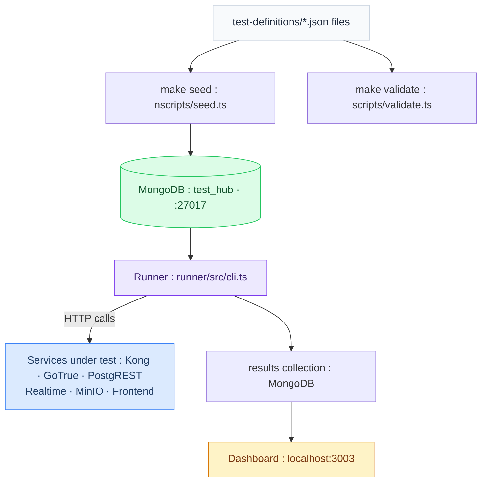

# PRISMATICA · QA

*QA infrastructure for the Prismatica / ft_transcendence project — by Univers42, 2026.*

prismatica-qa is the dedicated QA repository for [ft_transcendence](https://github.com/Univers42/transcendence). It implements a **Data-Driven Automation (DDA)** strategy: tests are defined as JSON documents stored in MongoDB, executed by a generic Node.js runner, and results persisted for dashboard reporting. No test framework lock-in. No hardcoded assertions. Tests are data.

---

## Table of Contents

- [Quick Start](#quick-start)
- [Architecture](#architecture)
- [Test Domains](#test-domains)
- [How to Add a Test](#how-to-add-a-test)
- [Running Tests](#running-tests)
- [CI Integration](#ci-integration)
- [Bibliography](#bibliography)
- [Use of AI](#use-of-ai)

---

## Quick Start

Prerequisites: Docker, Node.js 20+.

```bash
git clone https://github.com/Univers42/QA.git
cd QA
cp .env.example .env
make
```

`make` checks Docker, installs Node dependencies, and starts MongoDB. Then load the test definitions:

```bash
make seed       # load test-definitions/ into MongoDB
make validate   # validate all JSON files against schema
make test       # run the full suite
```

| Command | Description |
|---------|-------------|
| `make up` | Start MongoDB |
| `make down` | Stop MongoDB |
| `make seed` | Load / update test definitions from JSON files |
| `make validate` | Validate JSON files against schema (blocks on error) |
| `make test` | Run all active tests |
| `make test DOMAIN=auth` | Run tests for a specific domain |
| `make test PRIORITY=P0` | Run only P0 (blocking) tests |
| `make test DOMAIN=auth PRIORITY=P1 ENV=staging` | Combined filters |
| `make help` | Show all available commands |

The services under test (Kong, GoTrue, PostgREST, etc.) must be running in `mini-baas-infra` before executing tests. This repo only needs MongoDB running locally — it calls the other services by URL.

---

## Architecture



### Three-layer model

| Layer | What lives here | Technology |
|-------|----------------|------------|
| **Definitions** | What should happen — one JSON per test | Files in `test-definitions/` + MongoDB `tests` collection |
| **Runner** | How it executes — reads MongoDB, calls services, writes results | Node.js + TypeScript |
| **Results** | What happened — execution history and metrics | MongoDB `results` collection + React dashboard |

### Repository structure

```
prismatica-qa/
├── test-definitions/          # Source of truth for all tests (committed to git)
│   ├── auth/                  # AUTH-NNN tests
│   ├── gateway/               # GW-NNN tests
│   ├── schema/                # SCH-NNN tests
│   ├── api/                   # API-NNN tests
│   ├── realtime/              # RT-NNN tests
│   ├── storage/               # STG-NNN tests
│   ├── ui/                    # UI-NNN tests
│   └── infra/                 # INFRA-NNN tests
├── runner/                    # Generic test runner
│   └── src/
├── scripts/
│   ├── db.ts                  # MongoDB connection (shared by all scripts)
│   ├── seed.ts                # Loads test-definitions/ into MongoDB
│   └── validate.ts            # Validates JSON against schema
├── dashboard/                 # React results dashboard (Phase 4)
├── docs/
│   ├── test-template.json     # Copy this to create a new test
│   └── how-to-add-a-test.md   # Step-by-step guide
├── docker-compose.yml         # MongoDB only
├── Makefile
└── .env.example
```

---

## Test Domains

Each test belongs to one domain. The domain determines the ID prefix and which service is under test.

| Domain | Prefix | Service under test |
|--------|--------|--------------------|
| `auth` | `AUTH-` | GoTrue — authentication, OAuth, JWT, sessions |
| `gateway` | `GW-` | Kong — routing, rate limiting, CORS, JWT validation |
| `schema` | `SCH-` | schema-service — DDL lifecycle, collections, fields |
| `api` | `API-` | PostgREST — endpoints, RLS, filters, aggregations |
| `realtime` | `RT-` | Supabase Realtime — WebSocket, subscriptions |
| `storage` | `STG-` | MinIO — presigned URLs, buckets, file upload |
| `ui` | `UI-` | React frontend — components, hooks, stores |
| `infra` | `INFRA-` | Docker Compose, K8s, health checks |

### Priority levels

| Priority | Meaning | CI behaviour |
|----------|---------|--------------|
| `P0` | Blocking — system cannot function | Blocks merge if failing |
| `P1` | Critical — major feature broken | Blocks merge if failing |
| `P2` | Important — degraded experience | Warning only |
| `P3` | Nice to have | Report only |

---

## How to Add a Test

1. Copy `docs/test-template.json` to the correct domain folder:
   ```bash
   cp docs/test-template.json test-definitions/auth/AUTH-042.json
   ```

2. Fill in the fields. Base required fields: `id`, `title`, `domain`, `priority`, `status`.
   Type-specific fields depend on the test type: `http`, `bash`, or `manual`.

3. Validate:
   ```bash
   make validate
   ```

4. Seed into MongoDB:
   ```bash
   make seed
   ```

5. Commit the JSON file. The test definition lives in git — MongoDB is the execution engine, not the source of truth.

Full guide: [docs/how-to-add-a-test.md](docs/how-to-add-a-test.md)

### Python CLI

For developers who should not touch JSON by hand, use the Python CLI. In the current setup, persistence is local and the source of truth is the JSON committed in the repository:

```bash
python3 -m prismatica_qa add
python3 -m prismatica_qa run --type http --layer integration --domain auth
python3 -m prismatica_qa export --domain auth
```

What it does:
- `add` asks the minimum questions, validates a base model plus the correct derived model for the selected test type, creates the JSON and can sync it to local MongoDB
- `run` syncs the JSON definitions to local MongoDB, loads tests from MongoDB, validates them again, runs them in parallel and compares against the previous stored result
- `export` writes local MongoDB definitions back to JSON if needed
- `sync` upserts the JSON definitions into local MongoDB without manual MongoDB commands
- supported test types are `http`, `bash`, and `manual`

Important in this local mode:
- JSON files are the source of truth
- local MongoDB is only a synchronized execution store
- users must verify on their own that they have the latest repository version before adding, syncing, or running tests

---

## Running Tests

```bash
# Full suite
make test

# By domain
make test DOMAIN=auth
make test DOMAIN=gateway

# By priority (P0 = blocking, P1 = critical)
make test PRIORITY=P0
make test PRIORITY=P1

# Combined
make test DOMAIN=auth PRIORITY=P1

# Against a specific environment
make test ENV=staging

# Python runner with comparison against the last stored run
python3 -m prismatica_qa run --domain auth --type http --layer integration
```

The Python runner first syncs the JSON definitions into local MongoDB, then reads test definitions from MongoDB, executes the HTTP calls defined in each document, and writes results back to the `results` collection. Output is a table in the terminal showing `passed/failed`, duration and comparison against the previous stored run.

---

## CI Integration

This repo is called from the CI pipelines of `transcendence` and `mini-baas-infra` — it is not added as a submodule. Each pipeline clones `QA` and runs the relevant smoke suite:

```yaml
# Example: in transcendence/.github/workflows/ci.yml
- name: Run QA smoke tests
  run: |
    git clone https://github.com/Univers42/QA.git
    cd QA
    cp .env.example .env
    npm install
    make test DOMAIN=auth PRIORITY=P0
  env:
    MONGO_URI: ${{ secrets.MONGO_URI_ATLAS }}
    KONG_URL: http://localhost:8000
    GOTRUE_URL: http://localhost:9999
```

Atlas M0 (free tier) is used as the MongoDB target in CI so results are shared across all contributors. Local development uses the Docker Compose MongoDB instance.

---

## Bibliography

| Resource | What it informed |
|----------|-----------------|
| [MongoDB Node.js Driver](https://www.mongodb.com/docs/drivers/node/current/) | Driver API — `updateOne` with upsert, aggregation pipeline, typed collections |
| [AJV — Another JSON Validator](https://ajv.js.org/) | JSON Schema validation for test document definitions |
| [The Practical Test Pyramid — Martin Fowler](https://martinfowler.com/articles/practical-test-pyramid.html) | Test type classification (unit, integration, e2e, contract) and the smoke/contract distinction |
| [Data-Driven Testing — SmartBear](https://smartbear.com/learn/automated-testing/data-driven-testing/) | DDA philosophy: separating test data from test logic |
| [MongoDB Schema Design Patterns](https://www.mongodb.com/blog/post/building-with-patterns-a-summary) | Embedding vs referencing — why `results` is a separate collection from `tests` |
| [Conventional Commits 1.0](https://www.conventionalcommits.org/) | Commit format consistent with `transcendence` |
| [GitHub Actions — Service Containers](https://docs.github.com/en/actions/using-containerized-services/about-service-containers) | Running MongoDB in CI without a managed Atlas connection |

---

## Use of AI

AI tools were used during development of this repository. Concretely:

- **Architecture decisions** — the DDA approach, repo separation rationale, MongoDB schema design were discussed with Claude and iterated on
- **Scaffolding** — initial file structure, TypeScript types, seed and validate scripts
- **Documentation** — this README, `how-to-add-a-test.md`, inline code comments

What AI did not do: decide which tests to write, define what correct behaviour looks like for each service, or commit anything without being read and understood first. Test definitions — the JSON documents that encode expected behaviour — are written by the team based on the State of the Art document and direct knowledge of the system under test.

---

*Detailed test authoring guide: [docs/how-to-add-a-test.md](docs/how-to-add-a-test.md)*
*Main project repository: [Univers42/transcendence](https://github.com/Univers42/transcendence)*
*Infrastructure repository: [Univers42/mini-baas-infra](https://github.com/Univers42/mini-baas-infra)*
