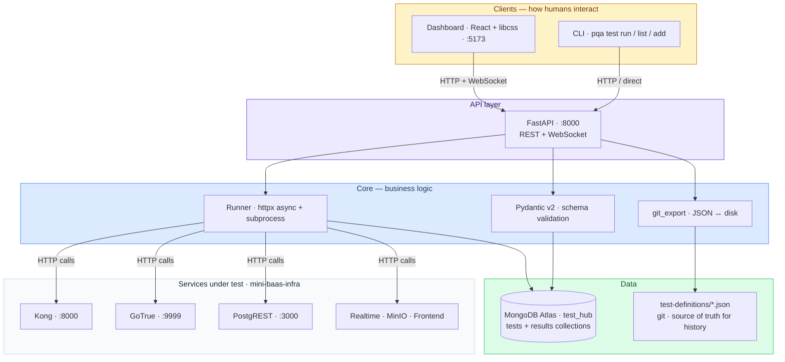

# PRISMATICA · QA

*QA infrastructure for the Prismatica / ft_transcendence project — by Univers42, 2026.*

prismatica-qa is the dedicated QA repository for [ft_transcendence](https://github.com/Univers42/transcendence). It implements a **Data-Driven Automation (DDA)** strategy: tests are defined as JSON documents, validated with Pydantic, stored in MongoDB Atlas, executed by a Python runner, and exposed through a FastAPI REST API. A React dashboard (built with libcss) and a CLI (`pqa`) both consume that API. No test framework lock-in. No hardcoded assertions. Tests are data.

---

## Table of Contents

- [Quick Start](#quick-start)
- [Architecture](#architecture)
- [Test Domains](#test-domains)
- [How to Add a Test](#how-to-add-a-test)
- [Running Tests](#running-tests)
- [API Reference](#api-reference)
- [Dashboard](#dashboard)
- [CI Integration](#ci-integration)
- [Bibliography](#bibliography)
- [Use of AI](#use-of-ai)

---

## Quick Start

Prerequisites: Python 3.11+, a MongoDB Atlas account (free M0 tier).

```bash
git clone https://github.com/Univers42/QA.git
cd QA
make
```

`make` verifies Python, creates a virtual environment, installs all dependencies, and registers the `pqa` CLI. Then configure your Atlas connection:

```bash
nano .env                          # set MONGO_URI_ATLAS with your Atlas connection string
.venv/bin/python scripts/verify_setup.py   # confirm Atlas connects
make migrate                       # load test-definitions/ into Atlas (run once)
```

| Command | Description |
|---------|-------------|
| `make` | Full setup: check Python, create venv, install deps |
| `make api` | Start FastAPI server on `:8000` (Swagger UI at `/docs`) |
| `make test` | Run all active tests |
| `make test DOMAIN=auth` | Run tests for a specific domain |
| `make test PRIORITY=P0` | Run only P0 (blocking) tests |
| `make list` | List all test definitions from Atlas |
| `make migrate` | Load JSON test definitions into Atlas (idempotent) |
| `make export` | Export tests from Atlas back to JSON files |
| `make dashboard` | Start React dashboard on `:5173` |
| `make clean` | Remove venv and caches |
| `make help` | Show all available commands |

The services under test (Kong, GoTrue, PostgREST, etc.) must be running in `mini-baas-infra` before executing tests. This repo only needs an Atlas connection — it calls the other services by URL.

---

## Architecture



### Three-layer model

| Layer | What lives here | Technology |
|-------|----------------|------------|
| **Core** | Business logic — schema validation, test execution, result persistence, git export | Python · Pydantic v2 · httpx · pymongo |
| **API** | REST interface — exposes the core as HTTP endpoints + WebSocket for live execution | FastAPI · uvicorn |
| **Clients** | How humans interact — terminal CLI and web dashboard | typer + Rich (CLI) · React + libcss (dashboard) |

### Repository structure

```
prismatica-qa/
├── core/                          # Business logic (no HTTP, no UI)
│   ├── db.py                      # Atlas connection (pymongo)
│   ├── schema.py                  # Pydantic v2 models: HttpTest, BashTest, ManualTest
│   └── git_export.py              # Write tests to test-definitions/ as JSON
├── runner/                        # Test execution engine
│   ├── executor.py                # HTTP test executor (httpx async)
│   ├── bash_executor.py           # Shell command executor (subprocess)
│   ├── results.py                 # Persist results to Atlas
│   └── ci.py                      # Minimal CI runner (no API dependency)
├── api/                           # FastAPI REST API
│   ├── main.py                    # App entrypoint + CORS
│   ├── deps.py                    # Shared dependencies
│   └── routers/
│       ├── tests.py               # CRUD: GET/POST/PATCH/DELETE /tests
│       ├── run.py                 # POST /tests/run + WebSocket /ws/run
│       └── results.py             # GET /results + /results/summary
├── cli/                           # pqa CLI (typer + Rich)
│   ├── main.py                    # Entrypoint: pqa test <command>
│   └── commands/
│       ├── list_cmd.py            # pqa test list
│       └── run_cmd.py             # pqa test run
├── dashboard/                     # React + libcss (Phase 6)
├── test-definitions/              # Source of truth for history (committed to git)
│   ├── auth/                      # AUTH-NNN tests
│   ├── gw/                        # GW-NNN tests
│   ├── infra/                     # INFRA-NNN tests
│   └── ...                        # api, realtime, storage, ui, schema
├── scripts/
│   ├── verify_setup.py            # Confirm Atlas connection works
│   └── migrate_v1_to_v2.py        # One-time migration: JSON → Atlas
├── docs/
│   ├── how-to-add-a-test.md       # Step-by-step guide
│   ├── test-template.json         # Reference template
│   └── strategy/                  # Roadmaps 0–4
├── requirements.txt               # Python dependencies
├── pyproject.toml                 # pqa entry point + project metadata
├── Makefile                       # CLI interface for all operations
└── .env.example                   # MONGO_URI_ATLAS + service URLs
```

### Data flow

```
test-definitions/*.json                          Atlas (test_hub)
  │                                                │
  │  make migrate                                  │  pqa test list / run
  │  (one-time: JSON → Atlas)                      │  (reads from Atlas)
  │                                                │
  └──────────────► tests collection ◄──────────────┘
                        │
                        │  pqa test run / make test
                        ▼
                   Runner (httpx)
                        │
                        │  HTTP calls to services
                        ▼
                   Services under test
                        │
                        │  response
                        ▼
                   results collection ──► Dashboard / CLI table
```

**Key principle:** JSON files in git are the historical source of truth. Atlas is the operational source of truth. They store different things — definitions vs execution state — and do not need to be synchronised.

---

## Test Domains

Each test belongs to one domain. The domain determines the ID prefix and which service is under test.

| Domain | Prefix | Service under test |
|--------|--------|--------------------|
| `auth` | `AUTH-` | GoTrue — authentication, OAuth, JWT, sessions |
| `gateway` | `GW-` | Kong — routing, rate limiting, CORS, JWT validation |
| `schema` | `SCH-` | schema-service — DDL lifecycle, collections, fields |
| `api` | `API-` | PostgREST — endpoints, RLS, filters, aggregations |
| `realtime` | `RT-` | Supabase Realtime — WebSocket, subscriptions |
| `storage` | `STG-` | MinIO — presigned URLs, buckets, file upload |
| `ui` | `UI-` | React frontend — components, hooks, stores |
| `infra` | `INFRA-` | Docker Compose, K8s, health checks |

### Priority levels

| Priority | Meaning | CI behaviour |
|----------|---------|--------------|
| `P0` | Blocking — system cannot function | Blocks merge if failing |
| `P1` | Critical — major feature broken | Blocks merge if failing |
| `P2` | Important — degraded experience | Warning only |
| `P3` | Nice to have | Report only |

### Test types

| Type | Executor | Use case |
|------|----------|----------|
| `http` | `runner/executor.py` | API calls — check status code, body content, JWT claims |
| `bash` | `runner/bash_executor.py` | Shell commands — check exit code, stdout content |
| `manual` | None (skipped) | Human verification — specifications not yet automated |

---

## How to Add a Test

### Option A — Via the API (recommended)

With the API running (`make api`), send a POST request:

```bash
curl -X POST http://localhost:8000/tests \
  -H "Content-Type: application/json" \
  -d '{
    "id": "AUTH-004",
    "title": "Token refresh returns new access_token",
    "domain": "auth",
    "priority": "P1",
    "status": "draft",
    "type": "http",
    "url": "http://localhost:9999/auth/v1/token?grant_type=refresh_token",
    "method": "POST",
    "expected": {"statusCode": 200, "bodyContains": ["access_token"]}
  }'
```

The API validates the test with Pydantic, writes it to Atlas, and exports the JSON file to `test-definitions/auth/AUTH-004.json`. Commit the file to git.

### Option B — Via the dashboard (once available)

Open the dashboard, click "Add Test", fill in the form, and submit. The dashboard calls the same API endpoint.

### Option C — Edit JSON directly

Copy the template, fill in the fields, and run the migration:

```bash
cp docs/test-template.json test-definitions/auth/AUTH-004.json
# edit the file
make migrate
```

Required fields: `id`, `title`, `domain`, `priority`, `status`. For HTTP tests, also: `type`, `url`, `method`, `expected`.

Full guide: [docs/how-to-add-a-test.md](docs/how-to-add-a-test.md)

---

## Running Tests

```bash
# Full suite (all active tests)
make test

# By domain
make test DOMAIN=auth
make test DOMAIN=infra

# By priority
make test PRIORITY=P0

# Combined
make test DOMAIN=auth PRIORITY=P1

# List without executing
make list
```

The runner reads active test definitions from Atlas, executes the HTTP or bash calls, persists results back to Atlas, and prints a pass/fail table in the terminal. Exit code is 1 if any test fails — CI compatible.

---

## API Reference

Start the API with `make api`. Interactive documentation is auto-generated at:

- **Swagger UI:** [http://localhost:8000/docs](http://localhost:8000/docs)
- **ReDoc:** [http://localhost:8000/redoc](http://localhost:8000/redoc)

### Endpoints

| Method | Path | Description |
|--------|------|-------------|
| `GET` | `/` | Health check |
| `GET` | `/tests` | List tests (query: `domain`, `priority`, `status`) |
| `GET` | `/tests/{id}` | Get a test by ID |
| `POST` | `/tests` | Create a test (validates + exports JSON) |
| `PATCH` | `/tests/{id}` | Update a test |
| `DELETE` | `/tests/{id}` | Soft-delete (set status to deprecated) |
| `POST` | `/tests/run` | Execute tests (query: `domain`, `priority`, `id`) |
| `GET` | `/results` | List execution results (query: `test_id`, `passed`, `limit`) |
| `GET` | `/results/summary` | Aggregate pass/fail by domain |
| `WS` | `/ws/run` | WebSocket — stream results test by test in real time |

---

## Dashboard

*Phase 6 — under development.*

The dashboard is a React application built with [libcss](https://github.com/Univers42/transcendence) components (Button, FormField, ThemeToggle, SplitLayout) that consumes the FastAPI endpoints. It provides:

- **Test list:** table with sorting, filtering by domain/priority/status, and per-row Run button
- **Live execution:** WebSocket connection showing results as they arrive
- **Test form:** create and edit tests through a guided form
- **Result history:** execution timeline per test with pass/fail trends

Start with `make dashboard` once the feature is implemented.

---

## CI Integration

This repo is called from the CI pipelines of `transcendence` and `mini-baas-infra` — it is not added as a submodule. Each pipeline clones `QA` and runs the smoke suite using the CI runner (no API server needed):

```yaml
# Example: in transcendence/.github/workflows/ci.yml
- name: Run QA smoke tests
  run: |
    git clone https://github.com/Univers42/QA.git
    cd QA
    pip install -r requirements.txt
    python -m runner.ci --priority P0
  env:
    MONGO_URI_ATLAS: ${{ secrets.MONGO_URI_ATLAS }}
    GOTRUE_URL: http://localhost:9999
    POSTGREST_URL: http://localhost:3000
```

The CI runner (`runner/ci.py`) imports the core directly — it does not start a FastAPI server. This keeps CI fast and dependency-light.

Atlas M0 (free tier) is used as the shared MongoDB backend so results from all contributors and CI runs are visible in one place.

---

## Bibliography

| Resource | What it informed |
|----------|-----------------|
| [FastAPI Documentation](https://fastapi.tiangolo.com/) | REST API design, dependency injection, WebSocket support |
| [Pydantic v2 Documentation](https://docs.pydantic.dev/) | Schema validation, discriminated unions, model inheritance |
| [MongoDB pymongo Driver](https://pymongo.readthedocs.io/) | Atlas connection, upsert, aggregation pipeline, TTL indexes |
| [typer Documentation](https://typer.tiangolo.com/) | CLI framework — subcommands, autocompletion, help generation |
| [Rich Documentation](https://rich.readthedocs.io/) | Terminal tables, colours, progress bars |
| [httpx Documentation](https://www.python-httpx.org/) | Async HTTP client for test execution |
| [The Practical Test Pyramid — Martin Fowler](https://martinfowler.com/articles/practical-test-pyramid.html) | Test type classification and the smoke/contract distinction |
| [Data-Driven Testing — SmartBear](https://smartbear.com/learn/automated-testing/data-driven-testing/) | DDA philosophy: separating test data from test logic |
| [Conventional Commits 1.0](https://www.conventionalcommits.org/) | Commit format consistent with `transcendence` |

---

## Use of AI

AI tools were used during development of this repository. Concretely:

- **Architecture decisions** — the DDA approach, repo separation rationale, MongoDB schema design, the three-layer architecture (Core → API → Clients), and the decision to use Atlas as sole operational backend were discussed with Claude and iterated on
- **Scaffolding** — repository structure, Pydantic models, FastAPI routers, CLI commands, Makefile, migration scripts
- **Documentation** — this README, `how-to-add-a-test.md`, roadmap documents, inline code comments

What AI did not do: decide which tests to write, define what correct behaviour looks like for each service, configure MongoDB Atlas, or commit anything without being read and understood first. Test definitions — the JSON documents that encode expected behaviour — are written by the team based on the State of the Art document and direct knowledge of the system under test.

---

*Detailed test authoring guide: [docs/how-to-add-a-test.md](docs/how-to-add-a-test.md)*
*Architecture and session history: [docs/strategy/](docs/strategy/)*
*Main project repository: [Univers42/transcendence](https://github.com/Univers42/transcendence)*
*Infrastructure repository: [Univers42/mini-baas-infra](https://github.com/Univers42/mini-baas-infra)*
