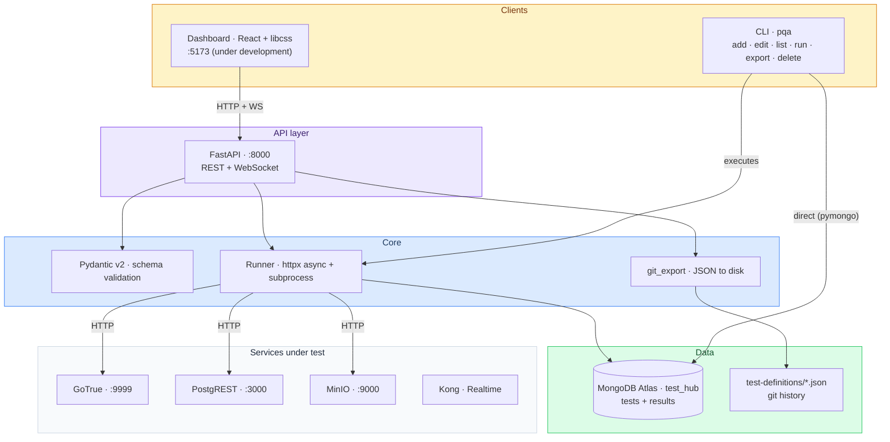

# PRISMATICA · QA

*QA infrastructure for the Prismatica / ft_transcendence project — by Univers42, 2026.*

prismatica-qa is the dedicated QA repository for [ft_transcendence](https://github.com/Univers42/transcendence). It implements a **Data-Driven Automation (DDA)** strategy: tests are defined as JSON documents, validated with Pydantic, stored in MongoDB Atlas, executed by a Python runner, and exposed through a FastAPI REST API. A CLI (`pqa`) provides guided test creation and management. A React dashboard (built with libcss) is under development. No test framework lock-in. No hardcoded assertions. Tests are data.

---
# IMPORTANT MESSAGE: THIS README NEEDS UPDATING!
# Change of strategy to implement shown in document 6-roadmap.md
# !!!!!!!!!!!!!!!!!!!!!!!!!!!!!!!!!!!!!!!!!!!!!!!!!!!!!!!
---

## Table of Contents

- [Quick Start](#quick-start)
- [Architecture](#architecture)
- [Test Domains](#test-domains)
- [How to Add a Test](#how-to-add-a-test)
- [Running Tests](#running-tests)
- [All Commands](#all-commands)
- [API Reference](#api-reference)
- [Code Quality](#code-quality)
- [Git Hooks](#git-hooks)
- [Dashboard](#dashboard)
- [CI Integration](#ci-integration)
- [Documentation](#documentation)
- [Bibliography](#bibliography)
- [Use of AI](#use-of-ai)

---

## Quick Start

Prerequisites: Python 3.11+, a MongoDB Atlas account (free M0 tier).

```bash
git clone https://github.com/Univers42/QA.git
cd QA
make
```

`make` verifies Python, creates a virtual environment, installs all dependencies, registers the `pqa` CLI, and installs git hooks. Then configure your Atlas connection:

```bash
nano .env                                      # set MONGO_URI_ATLAS
.venv/bin/python scripts/verify_setup.py       # confirm Atlas connects
make migrate                                   # load test-definitions/ into Atlas (once)
make list                                      # see all tests
make test                                      # run active tests
```

---

## Architecture



### Three-layer model

| Layer | What lives here | Technology |
|-------|----------------|------------|
| **Core** | Schema validation, test execution, result persistence, git export | Python · Pydantic v2 · httpx · pymongo |
| **API** | REST endpoints + WebSocket for live execution | FastAPI · uvicorn |
| **Clients** | Terminal CLI and web dashboard | typer + Rich (CLI) · React + libcss (dashboard) |

### Repository structure

```
prismatica-qa/
├── core/                          # Business logic
│   ├── db.py                      # Atlas connection (pymongo)
│   ├── schema.py                  # Pydantic v2: HttpTest, BashTest, ManualTest
│   └── git_export.py              # Write tests as JSON to disk
├── runner/                        # Test execution engine
│   ├── executor.py                # HTTP executor (httpx async)
│   ├── bash_executor.py           # Shell command executor
│   ├── results.py                 # Persist results to Atlas
│   └── ci.py                      # Minimal CI runner
├── api/                           # FastAPI REST API
│   ├── main.py                    # App + CORS
│   └── routers/                   # tests.py · run.py · results.py
├── cli/                           # pqa CLI (typer + Rich)
│   ├── main.py                    # Entrypoint
│   └── commands/                  # add · edit · delete · export · list · run
├── hooks/                         # Git hooks
│   ├── pre-commit                 # File validation + ruff on main
│   ├── commit-msg                 # Conventional Commits
│   └── pre-push                   # Commit message validation
├── dashboard/                     # React + libcss (under development)
├── test-definitions/              # JSON source of truth (git)
├── scripts/                       # verify_setup.py · migrate_v1_to_v2.py
├── docs/                          # Guides + roadmaps
├── requirements.txt
├── pyproject.toml                 # pqa entry point + ruff config
├── Makefile
└── .env.example
```

---

## Test Domains

| Domain | Prefix | Service under test |
|--------|--------|--------------------|
| `auth` | `AUTH-` | GoTrue — login, OAuth, JWT, sessions |
| `gateway` | `GW-` | Kong — routing, rate limiting, CORS |
| `schema` | `SCH-` | schema-service — DDL lifecycle, collections, fields |
| `api` | `API-` | PostgREST or QA API — endpoints, filters, RLS |
| `realtime` | `RT-` | Supabase Realtime — WebSocket, subscriptions |
| `storage` | `STG-` | MinIO — presigned URLs, buckets, file upload |
| `ui` | `UI-` | React frontend — components, hooks, stores |
| `infra` | `INFRA-` | Docker, health checks, Atlas, infrastructure |

### Priority levels

| Priority | Meaning | CI behaviour |
|----------|---------|--------------|
| `P0` | System cannot function | Blocks merge |
| `P1` | Critical feature broken | Blocks merge |
| `P2` | Degraded experience | Warning only |
| `P3` | Nice to have | Report only |

---

## How to Add a Test

```bash
make add                        # interactive mode with guided prompts
```

Or in one line:

```bash
.venv/bin/pqa test add --quick \
  --id AUTH-005 --title "Signup creates account" \
  --domain auth --priority P1 --type http \
  --url "http://localhost:9999/auth/v1/signup" \
  --method POST --expected-status 200
```

Full guide: [docs/how-to-add-a-test.md](docs/how-to-add-a-test.md)

---

## Running Tests

```bash
make test                       # all active tests
make test DOMAIN=auth           # only auth
make test PRIORITY=P0           # only blocking
make test ID=AUTH-003           # one test
```

---

## All Commands

| Command | Description |
|---------|-------------|
| `make` | Full setup (install + hooks) |
| `make api` | Start FastAPI on :8000 (Swagger at /docs) |
| `make test` | Run all active tests |
| `make test DOMAIN=auth` | Run auth tests only |
| `make test PRIORITY=P0` | Run P0 tests only |
| `make test ID=AUTH-003` | Run a single test |
| `make list` | List all tests |
| `make add` | Create a test (interactive) |
| `make edit ID=AUTH-003` | Edit a test |
| `make delete ID=AUTH-003` | Deprecate a test |
| `make export` | Export Atlas to JSON files |
| `make migrate` | Load JSON files into Atlas |
| `make lint` | Check PEP 8 compliance |
| `make fix` | Auto-fix lint issues |
| `make format` | Format code + fix |
| `make hooks` | Install git hooks |
| `make clean` | Remove venv + caches |
| `make re` | Full rebuild |
| `make help` | Show categorised help |

---

## API Reference

Start with `make api`. Swagger UI at [http://localhost:8000/docs](http://localhost:8000/docs).

| Method | Path | Description |
|--------|------|-------------|
| `GET` | `/` | Health check |
| `GET` | `/tests` | List tests (filters: `domain`, `priority`, `status`) |
| `GET` | `/tests/{id}` | Get test by ID |
| `POST` | `/tests` | Create test (validates + exports JSON) |
| `PATCH` | `/tests/{id}` | Update test |
| `DELETE` | `/tests/{id}` | Soft-delete (deprecated) |
| `POST` | `/tests/run` | Execute tests (filters: `domain`, `priority`, `id`) |
| `GET` | `/results` | Execution history |
| `GET` | `/results/summary` | Pass/fail counts by domain |
| `WS` | `/ws/run` | Stream results in real time |

---

## Code Quality

PEP 8 enforced by [ruff](https://docs.astral.sh/ruff/). On `main`, the pre-commit hook blocks non-compliant code. On feature branches, ruff is not enforced.

```bash
make lint                       # check (read-only)
make fix                        # auto-fix
make format                     # format + fix
```

---

## Git Hooks

Installed automatically by `make`. Same Conventional Commits format as transcendence.

| Hook | What it does |
|------|-------------|
| `pre-commit` | Blocks merge markers, sensitive files, large files, cache files. Runs ruff on main. |
| `commit-msg` | Enforces `type(scope): Description` (25-170 chars, uppercase, no WIP/TODO) |
| `pre-push` | Validates commit messages of new commits |

Bypass: `SKIP_PRE_COMMIT=1`, `SKIP_COMMIT_MSG=1`, `SKIP_PRE_PUSH=1`

---

## Dashboard

*Under development — Phase 6.*

React application with libcss components consuming the FastAPI endpoints. Planned: test list with filters, live WebSocket execution, guided test form, result history.

---

## CI Integration

```yaml
- name: Run QA smoke tests
  run: |
    git clone https://github.com/Univers42/QA.git
    cd QA
    pip install -r requirements.txt
    python -m runner.ci --priority P0
  env:
    MONGO_URI_ATLAS: ${{ secrets.MONGO_URI_ATLAS }}
```

---

## Documentation

| Document | What it covers |
|----------|---------------|
| [docs/usage-guide.md](docs/usage-guide.md) | Quick reference: commands, tables, troubleshooting |
| [docs/python-guide.md](docs/python-guide.md) | Python onboarding for C/JS developers |
| [docs/how-to-add-a-test.md](docs/how-to-add-a-test.md) | Step-by-step test authoring |
| [docs/strategy/](docs/strategy/) | Roadmaps 0-5: architecture decisions and history |

---

## Bibliography

| Resource | What it informed |
|----------|-----------------|
| [FastAPI](https://fastapi.tiangolo.com/) | REST API, dependency injection, WebSocket |
| [Pydantic v2](https://docs.pydantic.dev/) | Schema validation, discriminated unions |
| [pymongo](https://pymongo.readthedocs.io/) | Atlas connection, TTL indexes |
| [typer](https://typer.tiangolo.com/) | CLI framework |
| [Rich](https://rich.readthedocs.io/) | Terminal UI |
| [Ruff](https://docs.astral.sh/ruff/) | Linter + formatter |
| [httpx](https://www.python-httpx.org/) | Async HTTP client |
| [Practical Test Pyramid — Fowler](https://martinfowler.com/articles/practical-test-pyramid.html) | Test classification |
| [Data-Driven Testing — SmartBear](https://smartbear.com/learn/automated-testing/data-driven-testing/) | DDA philosophy |
| [Conventional Commits](https://www.conventionalcommits.org/) | Commit format |

---

## Use of AI

AI tools were used during development. Concretely: architecture decisions, scaffolding, documentation, and the Python onboarding guide were discussed with Claude and iterated on. What AI did not do: decide which tests to write, define correct behaviour for each service, configure Atlas, or commit anything without being read and understood first. Test definitions are written by the team based on direct knowledge of the system under test.

---

*Quick reference: [docs/usage-guide.md](docs/usage-guide.md) · Test authoring: [docs/how-to-add-a-test.md](docs/how-to-add-a-test.md) · Python guide: [docs/python-guide.md](docs/python-guide.md)*
*Main project: [Univers42/transcendence](https://github.com/Univers42/transcendence) · Infrastructure: [Univers42/mini-baas-infra](https://github.com/Univers42/mini-baas-infra)*
