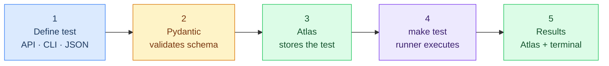
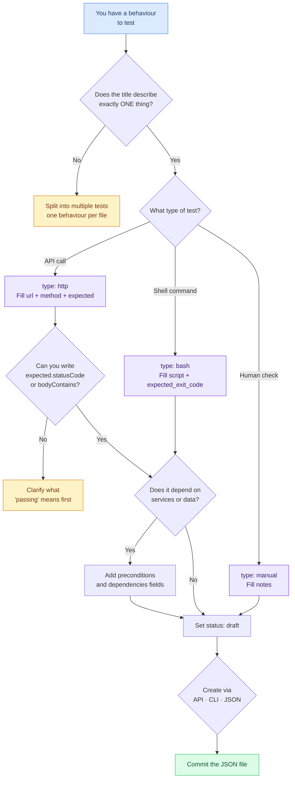

# How to Add a Test

This guide explains how to write a test definition for the Prismatica QA Test Hub. No prior testing framework knowledge required — a test is just a JSON document that describes what should happen when a service is called.

---

## The core idea

In most testing frameworks, tests are code. Here, **tests are data**. You describe the expected behaviour in a JSON document. The system validates it with Pydantic, stores it in MongoDB Atlas, and the runner executes it. You never touch the runner code to add a new test.



There are **three ways** to add a test. Pick whichever fits your workflow:

| Method | Best for | Requires |
|--------|----------|----------|
| **API** (POST /tests) | Quick creation via curl or Swagger UI | `make api` running |
| **CLI** (`pqa test add`) | Guided interactive terminal flow | `pqa` installed |
| **JSON file** + `make migrate` | Editing in your IDE, bulk imports | Nothing extra |

All three paths end in the same place: a validated document in Atlas and a JSON file in `test-definitions/` ready to commit.

---

## Step 1 — Pick the right domain and ID

Every test belongs to one domain. The domain determines where the file lives and what prefix the ID uses.

| Domain | Folder | ID prefix | What it tests |
|--------|--------|-----------|---------------|
| `auth` | `test-definitions/auth/` | `AUTH-` | GoTrue — login, OAuth, JWT, sessions |
| `gateway` | `test-definitions/gw/` | `GW-` | Kong — routing, rate limiting, CORS |
| `schema` | `test-definitions/schema/` | `SCH-` | schema-service — collections, fields, DDL |
| `api` | `test-definitions/api/` | `API-` | PostgREST or QA API — endpoints, filters, RLS |
| `realtime` | `test-definitions/realtime/` | `RT-` | Supabase Realtime — WebSocket |
| `storage` | `test-definitions/storage/` | `STG-` | MinIO — file upload, presigned URLs |
| `ui` | `test-definitions/ui/` | `UI-` | React frontend — components, hooks |
| `infra` | `test-definitions/infra/` | `INFRA-` | Docker, health checks, infrastructure |

**ID format:** `PREFIX-NNN` where NNN is a zero-padded number. Look at the existing files in the folder and use the next available number.

```
AUTH-001.json   ← exists
AUTH-002.json   ← exists
AUTH-003.json   ← exists
AUTH-004.json   ← yours
```

---

## Step 2 — Pick the test type

Every test has a `type` that determines which executor runs it and which fields are required.

| Type | Executor | When to use | Required fields |
|------|----------|-------------|-----------------|
| `http` | `runner/executor.py` | API calls — check status code, body content | `url`, `method`, `expected` |
| `bash` | `runner/bash_executor.py` | Shell commands — check exit code, stdout | `script`, `expected_exit_code` |
| `manual` | None (skipped by runner) | Human verification — specs not yet automated | None beyond base |

### Base fields — required for ALL test types

These five fields must always be present. Pydantic will reject the document if any are missing.

| Field | Type | Description | Example |
|-------|------|-------------|---------|
| `id` | string | Unique identifier. Format: `PREFIX-NNN` | `"AUTH-004"` |
| `title` | string | One sentence: what should happen (min 5 chars) | `"Login with valid credentials returns access token"` |
| `domain` | string | One of the 8 domains above | `"auth"` |
| `priority` | string | `P0` · `P1` · `P2` · `P3` (see below) | `"P1"` |
| `status` | string | `active` · `draft` · `deprecated` · `skipped` | `"draft"` |

**Priority guide:**

| Priority | Meaning | Effect in CI |
|----------|---------|--------------|
| `P0` | System cannot function without this | Blocks merge |
| `P1` | Critical feature broken | Blocks merge |
| `P2` | Degraded experience | Warning only |
| `P3` | Nice to have | Report only |

### Additional fields for HTTP tests

| Field | Type | Description | Example |
|-------|------|-------------|---------|
| `type` | string | Must be `"http"` | `"http"` |
| `url` | string | The endpoint being called | `"http://localhost:9999/health"` |
| `method` | string | `GET` · `POST` · `PUT` · `PATCH` · `DELETE` | `"POST"` |
| `headers` | object | Additional HTTP headers | `{"Content-Type": "application/json"}` |
| `payload` | object | Request body for POST/PUT/PATCH | `{"email": "test@example.com"}` |
| `expected` | object | What a passing response looks like | `{"statusCode": 200}` |
| `timeout_ms` | number | Max wait time in milliseconds (default: 5000) | `5000` |

### Additional fields for bash tests

| Field | Type | Description | Example |
|-------|------|-------------|---------|
| `type` | string | Must be `"bash"` | `"bash"` |
| `script` | string | Shell command to run | `"pg_isready -h localhost -p 5432"` |
| `expected_exit_code` | number | Expected exit code (default: 0) | `0` |
| `expected_output` | string | String that must appear in stdout | `"ok"` |
| `timeout_seconds` | number | Max wait time in seconds (default: 30) | `10` |

### Additional fields for manual tests

| Field | Type | Description | Example |
|-------|------|-------------|---------|
| `type` | string | `"manual"` or omitted | `"manual"` |
| `notes` | string | What a human should verify | `"Check that the error message appears inline"` |

### Optional metadata — any test type can include these

| Field | Type | Description |
|-------|------|-------------|
| `description` | string | Full explanation of what this test verifies and why it matters |
| `service` | string | The service name under test (`auth-service`, `dynamic-api`, etc.) |
| `tags` | array | Keywords for filtering (`["oauth", "jwt", "smoke"]`) |
| `preconditions` | array | What must be true before this test runs (`["GoTrue running on :9999"]`) |
| `dependencies` | array | Services that must be up (`["postgres", "redis"]`) |
| `environment` | array | Where this test applies (`["local", "staging"]`) |
| `phase` | string | Migration phase this test belongs to (`"phase-0"`, `"phase-1"`, etc.) |
| `author` | string | Your 42 login |
| `notes` | string | Anything a future reader needs to know |

### The `expected` object (HTTP tests)

This is what the runner checks. You can use any combination of these:

```json
"expected": {
  "statusCode": 200,
  "bodyContains": ["access_token", "refresh_token"],
  "jwtClaims": {
    "role": "authenticated"
  },
  "cookieSet": "sb-refresh-token"
}
```

| Key | Meaning | Status |
|-----|---------|--------|
| `statusCode` | Expected HTTP status code | ✅ Implemented |
| `bodyContains` | Array of strings that must appear in the response body | ✅ Implemented |
| `jwtClaims` | Fields that must exist in the decoded JWT payload | ⏳ Planned |
| `cookieSet` | Name of a cookie that must be set in the response | ⏳ Planned |

---

## Step 3 — Create the test

### Option A — Via the API (recommended for quick creation)

With the API running (`make api`), send a POST request:

```bash
curl -X POST http://localhost:8000/tests \
  -H "Content-Type: application/json" \
  -d '{
    "id": "AUTH-004",
    "title": "Token refresh returns new access_token",
    "domain": "auth",
    "priority": "P1",
    "status": "draft",
    "type": "http",
    "url": "http://localhost:9999/auth/v1/token?grant_type=refresh_token",
    "method": "POST",
    "expected": {"statusCode": 200, "bodyContains": ["access_token"]}
  }'
```

The API validates with Pydantic, writes to Atlas, and exports the JSON file to `test-definitions/auth/AUTH-004.json` automatically.

You can also use the **Swagger UI** at `http://localhost:8000/docs` — it provides an interactive form for all endpoints.

### Option B — Via the CLI

```bash
pqa test add
```

The CLI walks you through each field interactively. Or use `--quick` mode with all flags in one line:

```bash
pqa test add \
  --id AUTH-004 \
  --title "Token refresh returns new access_token" \
  --domain auth \
  --priority P1 \
  --type http \
  --url "http://localhost:9999/auth/v1/token?grant_type=refresh_token" \
  --method POST \
  --expected-status 200 \
  --expected-body access_token
```

### Option C — Edit JSON directly

Copy the template and fill in the fields:

```bash
cp docs/test-template.json test-definitions/auth/AUTH-004.json
# Edit the file in your IDE
make migrate    # load into Atlas
```

---

## Step 4 — Complete examples

### HTTP test — API health check

```json
{
  "id": "API-001",
  "title": "QA API health endpoint responds on port 8000",
  "description": "GET to the root of the Prismatica QA API. Verifies the FastAPI server is running.",
  "domain": "api",
  "type": "http",
  "priority": "P0",
  "tags": ["qa-api", "fastapi", "smoke"],
  "service": "qa-api",
  "expected": {
    "statusCode": 200,
    "bodyContains": ["prismatica-qa-api"]
  },
  "url": "http://localhost:8000/",
  "method": "GET",
  "author": "dlesieur",
  "phase": "phase-2",
  "status": "active"
}
```

### Bash test — Atlas connectivity

```json
{
  "id": "INFRA-001",
  "title": "MongoDB Atlas responds to ping",
  "description": "Verifies the QA Hub's MongoDB Atlas instance is reachable.",
  "domain": "infra",
  "type": "bash",
  "priority": "P0",
  "tags": ["mongodb", "atlas", "smoke"],
  "script": ".venv/bin/python -c \"from core.db import get_db; get_db().command('ping'); print('ok')\"",
  "expected_exit_code": 0,
  "expected_output": "ok",
  "timeout_seconds": 10,
  "author": "vjan-nie",
  "status": "active"
}
```

### Manual test — UI verification

```json
{
  "id": "UI-001",
  "title": "Login form shows inline error on empty submit",
  "domain": "ui",
  "type": "manual",
  "priority": "P2",
  "status": "draft",
  "notes": "Open /auth, leave email and password empty, click Submit. Verify that inline validation messages appear without a page reload."
}
```

---

## Step 5 — Commit the file

The JSON file is the historical source of truth. Atlas is the operational source of truth. **Always commit the JSON.**

```bash
git add test-definitions/auth/AUTH-004.json
git commit -m "test(auth): add AUTH-004 token refresh"
```

Commit format follows [Conventional Commits](https://www.conventionalcommits.org/):
`test(domain): description`

---

## Common mistakes

**Test is too broad.**
`"The authentication system works correctly"` — this cannot be automated and does not tell you what failed.
Write one test per observable behaviour: `"Login with banned account returns 403"`.

**Missing preconditions.**
If your test needs a user to exist in the database, write that in `preconditions`. Otherwise the test will fail for the wrong reason and waste debugging time.

**Wrong status.**
New tests should start as `"draft"`. Change to `"active"` only once you have confirmed the test passes against a running environment. A failing `"active"` test in CI blocks everyone.

**ID already taken.**
Pydantic validates uniqueness against Atlas. If you create via the API or CLI, you get an immediate error. If you edit JSON directly, `make migrate` uses upsert — a duplicate ID silently overwrites the existing test.

**Wrong type field.**
If you write `"type": "integration"` instead of `"type": "http"`, the runner will still try to execute it as HTTP (it falls back when a `url` is present), but the schema validation is less precise. Always use `http`, `bash`, or `manual`.

---

## Flowchart: is your test well-defined?



---

*For architecture and full command reference, see `README.md`.*
*For roadmap and session history, see `docs/strategy/`.*
