# Prismatica QA — Roadmap 0

*What we built, how it works, and where we go next.*

*March 2026 · Version 1.0 · vjan-nie*

---

## Table of Contents

- [1. What This Repository Is](#1-what-this-repository-is)
- [2. What We Built in Phase 0](#2-what-we-built-in-phase-0)
- [3. How Everything Connects](#3-how-everything-connects)
- [4. File by File — What Each File Does](#4-file-by-file--what-each-file-does)
- [5. How to Use This Day to Day](#5-how-to-use-this-day-to-day)
- [6. Architectural Decisions Explained](#6-architectural-decisions-explained)
- [7. Progress Against Original Objectives](#7-progress-against-original-objectives)
- [8. Next Steps](#8-next-steps)

---

## 1. What This Repository Is

`QA` is a **dedicated QA repository** for the Prismatica / ft_transcendence project. It lives separately from both `transcendence` (the application) and `mini-baas-infra` (the infrastructure), and it tests both of them by calling their services over HTTP.

The core philosophy is called **DDA — Data-Driven Automation**. Instead of writing test code, you write test *data*: a JSON document that describes what should happen. A generic runner reads that document and checks if it does.

Think of it like PostgREST: instead of writing one endpoint per table, you define the table and the endpoint appears. DDA does the same for tests — define the expected behaviour as data, and the runner executes it automatically.

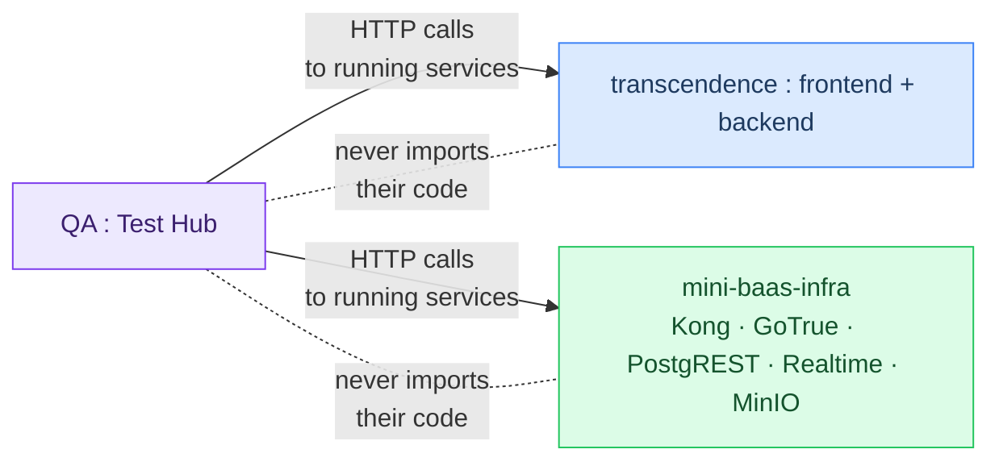

**Why a separate repo and not a subfolder inside `transcendence`?**
Because QA tests the whole system — frontend, backend, infrastructure — not just one part of it. If it lived inside `transcendence`, it couldn't test `mini-baas-infra` without circular dependencies. A separate repo can call any service by URL without belonging to any of them.

---

## 2. What We Built in Phase 0

Here is everything created in this session, in the order it was built and why.

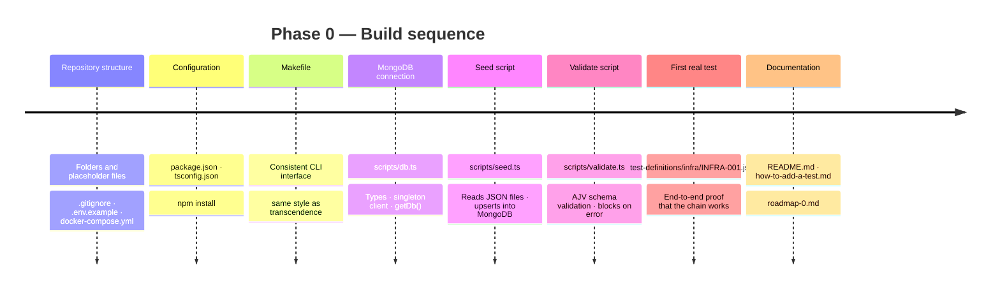

---

## 3. How Everything Connects

This diagram shows the complete data flow from writing a test to seeing a result.

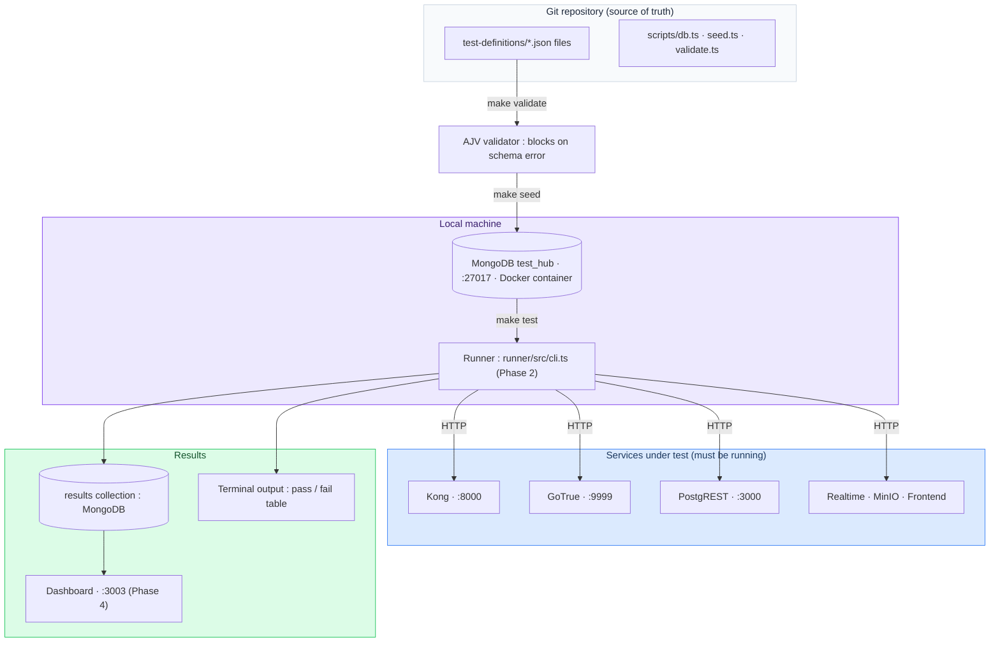

The key insight: **the JSON files are the source of truth, not MongoDB**. MongoDB is the execution engine. If MongoDB is wiped, `make seed` restores it from the JSON files in the repo. This is why we always commit the JSON files to git.

---

## 4. File by File — What Each File Does

### `docker-compose.yml`

Starts a single MongoDB container on port 27017. This is the only Docker service in this repo — we don't run Kong, GoTrue, or PostgREST here. Those run in `mini-baas-infra`.

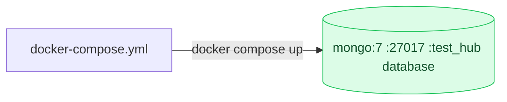

### `.env` / `.env.example`

Contains the MongoDB connection string and the base URLs for every service under test. The runner reads these to know where to send HTTP requests.

```
MONGO_URI=mongodb://localhost:27017/test_hub   ← where to store test data
KONG_URL=http://localhost:8000                 ← where to send API requests
GOTRUE_URL=http://localhost:9999               ← where to send auth requests
...
```

`.env` is never committed (it's in `.gitignore`). `.env.example` is committed so anyone who clones the repo knows what variables are needed.

### `Makefile`

The single entry point for every operation. Follows the same style as the `transcendence` Makefile so the team has a consistent experience across repos.

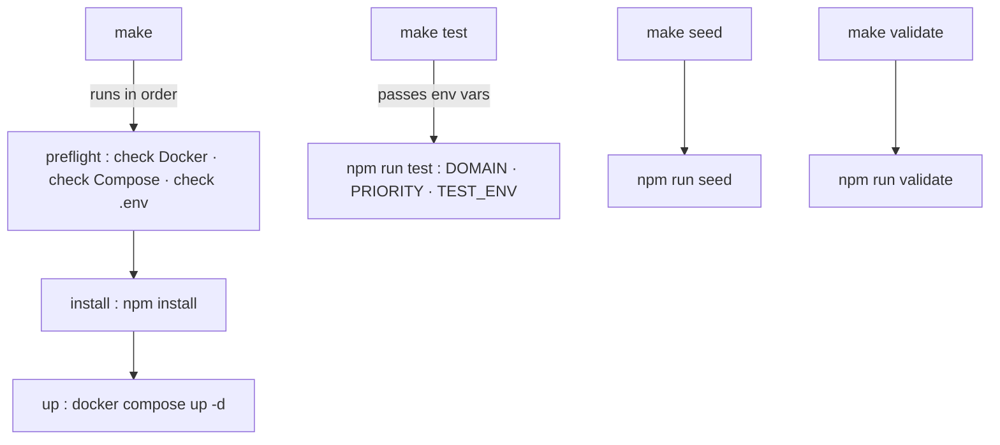

### `package.json`

Defines four scripts that the Makefile calls:

| Script | Command | Called by |
|--------|---------|-----------|
| `seed` | `ts-node scripts/seed.ts` | `make seed` |
| `validate` | `ts-node scripts/validate.ts` | `make validate` |
| `test` | `ts-node runner/src/cli.ts` | `make test` |
| `dev` | `ts-node --watch runner/src/cli.ts` | manual |

### `tsconfig.json`

TypeScript configuration with `strict: true` — consistent with `transcendence`. Covers the `runner/` and `scripts/` folders. `resolveJsonModule: true` allows importing JSON files directly if needed.

### `scripts/db.ts`

The **only file in the repo that knows how to connect to MongoDB**. Everything else imports from here.

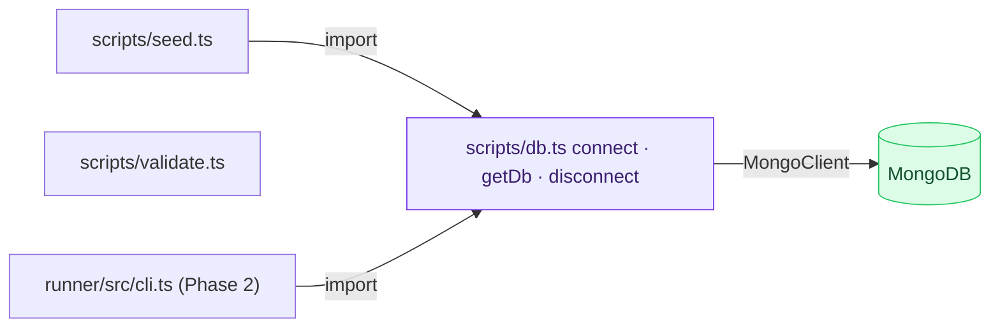

It exports:
- **TypeScript types** (`TestDefinition`, `TestResult`, `TestSuite`, `TestEnvironment`) — so every script that touches MongoDB has compile-time safety
- **`connect()`** — opens one connection and reuses it (singleton pattern)
- **`getDb()`** — returns the four collections already typed
- **`disconnect()`** — closes the connection cleanly when a script finishes

### `scripts/seed.ts`

Reads every `.json` file recursively from `test-definitions/`, checks that required fields are present, and does an **upsert** into the `tests` collection.

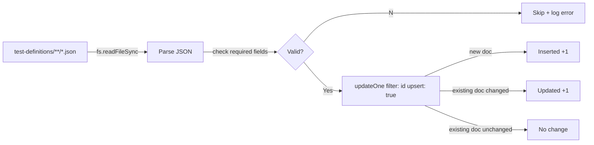

**Why upsert and not insert?** So `make seed` is idempotent — you can run it as many times as you want without creating duplicates. If you change a JSON file and re-run `make seed`, the document in MongoDB is updated automatically.

### `scripts/validate.ts`

Uses **AJV** (a JSON Schema validator) to check every test document against the official schema before it reaches MongoDB.

What it validates beyond required fields:
- `id` matches the pattern `DOMAIN-NNN` (e.g. `AUTH-001`, `INFRA-042`)
- `domain` is one of the 8 allowed values
- `type`, `layer`, `priority`, `status` are valid enum values
- `method` is a valid HTTP verb if present
- `title` has at least 5 characters

If any file fails, the process exits with code 1 — which means in CI it blocks the pipeline automatically.

### `test-definitions/infra/INFRA-001.json`

The first real test document. Smoke test that verifies MongoDB itself is reachable. It was used to prove the full chain works end to end:

```
write JSON → make validate → make seed → verify in mongosh
```

---

## 5. How to Use This Day to Day

### Starting a new working session

```bash
cd prismatica-qa

# Start MongoDB if it's not running
make up

# If someone added new test definitions since your last session
make seed
```

### Writing a new test

```bash
# 1. Copy the template to the right domain folder
cp docs/test-template.json test-definitions/auth/AUTH-003.json

# 2. Edit the file — fill in id, title, domain, type, layer, priority, expected, status

# 3. Validate it
make validate

# 4. Load it into MongoDB
make seed

# 5. Commit
git add test-definitions/auth/AUTH-003.json
git commit -m "test(auth): add AUTH-003 login with valid credentials"
```

### Running tests

```bash
# All active tests
make test

# Only a specific domain
make test DOMAIN=auth
make test DOMAIN=gateway

# Only blocking tests (use before a merge)
make test PRIORITY=P0

# Combined filters
make test DOMAIN=auth PRIORITY=P1

# Against staging instead of local
make test ENV=staging
```

### Before opening a pull request in any repo

```bash
# Run the P0 smoke suite to confirm nothing is broken
make test PRIORITY=P0
```

If any P0 test fails, do not open the PR until it is fixed.

---

## 6. Architectural Decisions Explained

These are the key decisions made during this session and the reasoning behind each one.

### Decision 1 — Separate repo, not a subfolder

**Rejected alternatives:**
- Subfolder inside `transcendence` — cannot test `mini-baas-infra` without circular dependency
- Subfolder inside `mini-baas-infra` — cannot test the React frontend cleanly
- Git submodule inside another repo — adds friction (`git submodule update --init` on every clone), silently goes stale, complicates history

**Chosen:** Independent repo, cloned separately in local dev, cloned on-demand in CI.

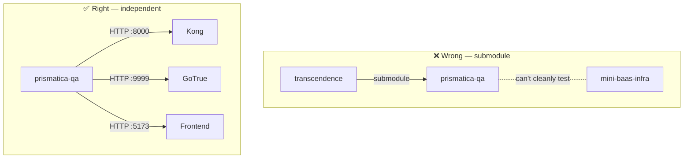

### Decision 2 — MongoDB as execution engine, JSON files as source of truth

**Why MongoDB and not just JSON files?**
The runner needs to query tests by domain, priority, and phase efficiently. MongoDB indexes make this instant even with hundreds of tests. JSON files in a folder don't support indexed queries.

**Why JSON files and not only MongoDB?**
Git is the source of truth for all code and configuration in this project. If MongoDB is wiped (new dev, CI runner, Docker reset), `make seed` restores everything from the JSON files. Tests must survive a database reset.

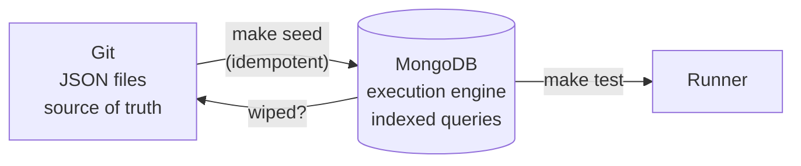

### Decision 3 — Local MongoDB via Docker, Atlas for CI

**Local development:** `mongo:7` container via `docker-compose.yml`. Each developer has their own instance. No shared state, no network latency, no account management.

**CI (GitHub Actions):** Atlas M0 free tier. Connection string in GitHub Secrets. Results from CI runs are visible to all contributors via Atlas UI or Compass.

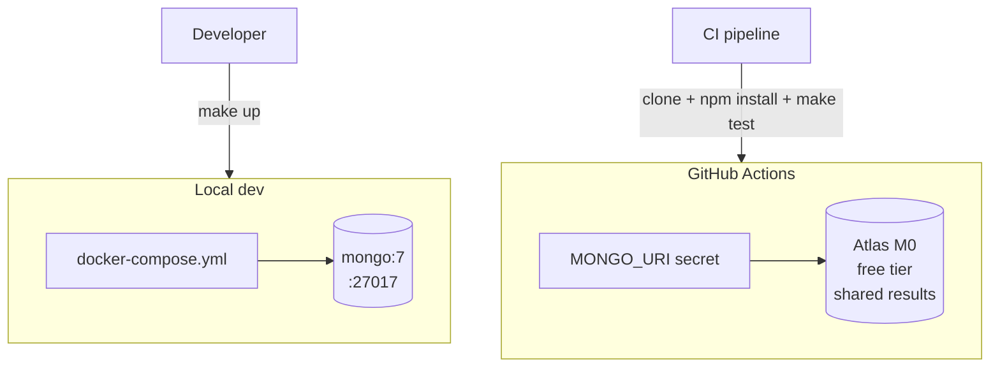

### Decision 4 — Runner executes on the host, not inside Docker

The runner is a Node.js script that runs directly on the developer's machine (or the CI runner), not inside a container. This means:

- `npm install` on the host, not `docker exec`
- The runner calls services on `localhost:8000`, `localhost:9999`, etc.
- No need to manage inter-container networking for the test runner itself

The only thing that runs in Docker in this repo is MongoDB.

### Decision 5 — Called from CI of other repos, not the other way round

`prismatica-qa` does not import or depend on code from `transcendence` or `mini-baas-infra`. The dependency goes the other way: those repos' CI pipelines clone `prismatica-qa` and call `make test`.

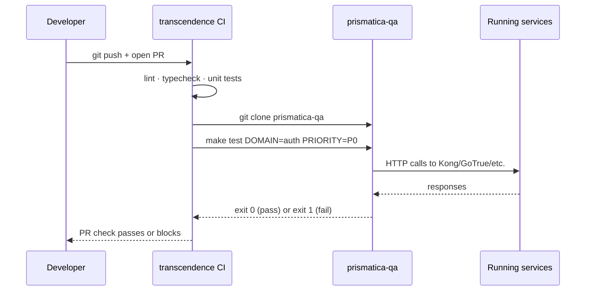

---

## 7. Progress Against Original Objectives

This section maps the current state against the original DDA + MongoDB Test Hub + TDD guide.

### Phase F0 — MongoDB infrastructure setup

| Task | Owner | Status |
|------|-------|--------|
| MongoDB local via Docker (`mongo:7`) | vjan-nie | ✅ Done — `docker-compose.yml` |
| Create `test_hub` database with 4 collections | vjan-nie | ✅ Done — created on first `make seed` |
| Apply recommended indexes | vjan-nie | ⏳ Pending — see Next Steps |
| Read-only user for team, write user for runner | vjan-nie | ⏳ Pending |
| Document connection string in `.env.example` | Both | ✅ Done |

### Phase F1 — First test documents and schema validation

| Task | Owner | Status |
|------|-------|--------|
| Define official JSON Schema (AJV) | dlesieur | ✅ Done — `scripts/validate.ts` |
| Write 5–10 smoke tests (AUTH, GW, INFRA) | dlesieur | 🔄 In progress — INFRA-001 done |
| Create "How to add a test" guide | dlesieur | ✅ Done — `docs/how-to-add-a-test.md` |
| Review schema with team (30 min session) | Both | ⏳ Pending |

### Phase F2 — Generic runner

| Task | Owner | Status |
|------|-------|--------|
| Node.js/TypeScript script that reads MongoDB and calls HTTP | vjan-nie | ⏳ Pending |
| Support GET/POST with payload and expected.statusCode | vjan-nie | ⏳ Pending |
| CLI: `--domain=auth --priority=P1 --env=local` | vjan-nie | ⏳ Pending |
| Terminal output: pass/fail table with duration | vjan-nie | ⏳ Pending |

### Phase F3 — CI integration and team training

| Task | Owner | Status |
|------|-------|--------|
| GitHub Actions step in `transcendence` CI | Both | ⏳ Pending |
| Team training session (45 min demo + hands-on) | dlesieur | ⏳ Pending |
| Each dev adds minimum 2 tests | Team | ⏳ Pending |

### Phase F4 — Results dashboard

| Task | Owner | Status |
|------|-------|--------|
| React page at `:3003` showing results from MongoDB | vjan-nie | ⏳ Pending |
| Filters by domain · priority · status · last_run.passed | vjan-nie | ⏳ Pending |
| Optional: trend chart pass/fail by day (Recharts) | vjan-nie | ⏳ Pending |

### Phase F5 — Expansion and automation

| Task | Owner | Status |
|------|-------|--------|
| Runner support for Realtime (WebSocket) tests | dlesieur | ⏳ Pending |
| Runner support for RLS (PostgREST) tests | dlesieur | ⏳ Pending |
| Runner support for MinIO tests | dlesieur | ⏳ Pending |
| Tag tests by migration phase (phase-0, phase-1...) | dlesieur | ✅ Done — `phase` field in schema |
| Pre-commit hook: run domain tests on service change | dlesieur | ⏳ Pending |
| README badges: % tests passing per domain | dlesieur | ⏳ Pending |

---

## 8. Next Steps

Ordered by priority. Everything here is unblocked — it can start now.

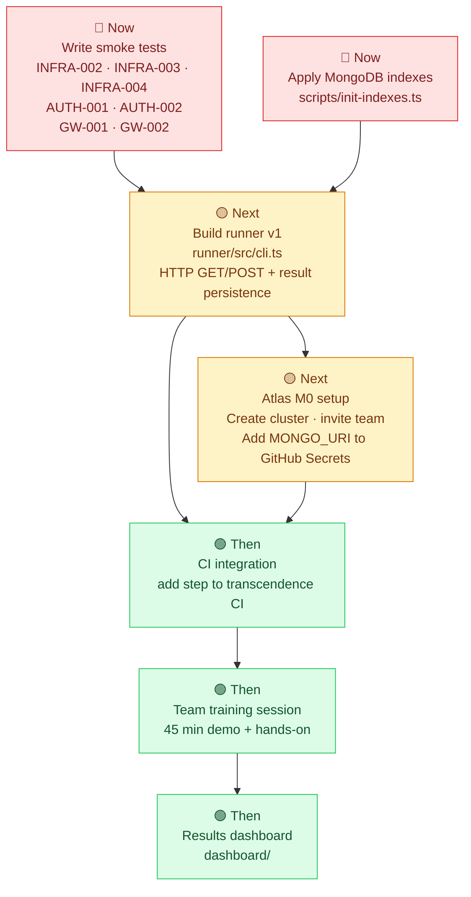

### Immediate — Smoke tests (dlesieur)

Write the Phase 0 smoke suite. These are P0 tests that verify each service is alive before anything else runs. Target: 10 tests covering INFRA, AUTH, and GW domains.

Files to create:
```
test-definitions/infra/INFRA-002.json   ← Kong proxy responds on :8000
test-definitions/infra/INFRA-003.json   ← GoTrue health endpoint
test-definitions/infra/INFRA-004.json   ← PostgREST responds on :3000
test-definitions/infra/INFRA-005.json   ← Redis responds to ping
test-definitions/auth/AUTH-001.json     ← Login returns access_token
test-definitions/auth/AUTH-002.json     ← Invalid credentials returns 400
test-definitions/auth/AUTH-003.json     ← Expired token returns 401
test-definitions/gateway/GW-001.json    ← Kong routes /auth to GoTrue
test-definitions/gateway/GW-002.json    ← Kong rate limiting returns 429
test-definitions/gateway/GW-003.json    ← Kong CORS headers present
```

### Immediate — MongoDB indexes (vjan-nie)

Create `scripts/init-indexes.ts` that applies the indexes from the original guide. Run once after `make up`:

```typescript
// scripts/init-indexes.ts
await tests.createIndex({ domain: 1, priority: 1, status: 1 })
await tests.createIndex({ tags: 1 })
await tests.createIndex({ phase: 1 })
await tests.createIndex({ id: 1 }, { unique: true })
await results.createIndex({ test_id: 1, executed_at: -1 })
await results.createIndex({ passed: 1, environment: 1, executed_at: -1 })
await results.createIndex({ git_sha: 1 })
```

Add `"init": "ts-node scripts/init-indexes.ts"` to `package.json` and a `make init` target to the Makefile.

### Next — Runner v1 (vjan-nie)

The runner is the piece that reads a test document from MongoDB, makes the HTTP call, and writes the result. Phase 2 from the original guide. Minimum viable version:

1. Reads tests from MongoDB filtered by `domain`, `priority`, `environment`, and `status: active`
2. For each test: calls `url` with `method` and `headers`/`payload`
3. Checks `response.status === expected.statusCode`
4. Checks response body contains all strings in `expected.bodyContains`
5. Writes a result document to the `results` collection
6. Prints a pass/fail table to the terminal

### Next — Atlas M0 setup (vjan-nie)

1. Create a free MongoDB Atlas account at [cloud.mongodb.com](https://cloud.mongodb.com)
2. Create an M0 cluster (free, no credit card)
3. Create a database user with `readWrite` on `test_hub`
4. Whitelist `0.0.0.0/0` for CI runners
5. Add the connection string to GitHub Secrets as `MONGO_URI_ATLAS`
6. Invite the team with read-only access to view results

### Then — CI integration (both)

Once the runner exists, add this step to `transcendence/.github/workflows/ci.yml`:

```yaml
- name: Clone QA repo and run smoke suite
  run: |
    git clone https://github.com/Univers42/prismatica-qa.git
    cd prismatica-qa
    cp .env.example .env
    npm install
    make test PRIORITY=P0
  env:
    MONGO_URI: ${{ secrets.MONGO_URI_ATLAS }}
    KONG_URL: http://localhost:8000
    GOTRUE_URL: http://localhost:9999
```

### Then — Team training (dlesieur)

Run the 45-minute onboarding session from the original guide once the runner is working and the smoke suite is passing:

| Time | Activity |
|------|----------|
| 0–10 min | Live demo: show a test passing in the terminal and in MongoDB |
| 10–20 min | Each dev writes one JSON for something they already implemented |
| 20–35 min | Group review: 3–4 volunteers read their JSON aloud, team gives feedback |
| 35–45 min | Pair writing: write one test for something not yet implemented (real TDD) |

---

*This document reflects the state of `prismatica-qa` as of March 21, 2026.*
*Update it when a phase is completed or a decision changes.*
*Main README: [README.md](README.md) · Test guide: [docs/how-to-add-a-test.md](docs/how-to-add-a-test.md)*
