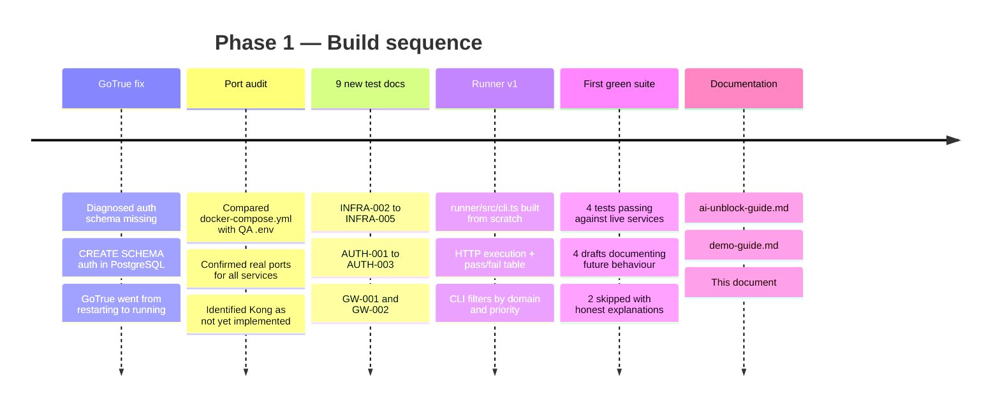
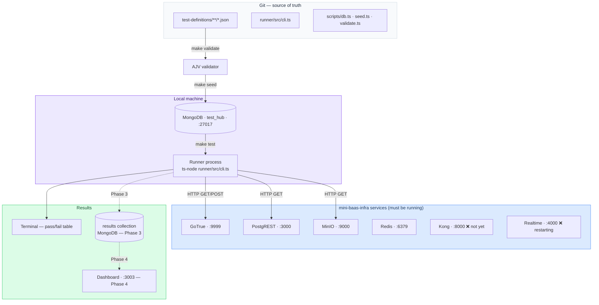
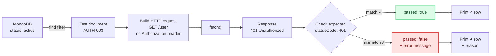
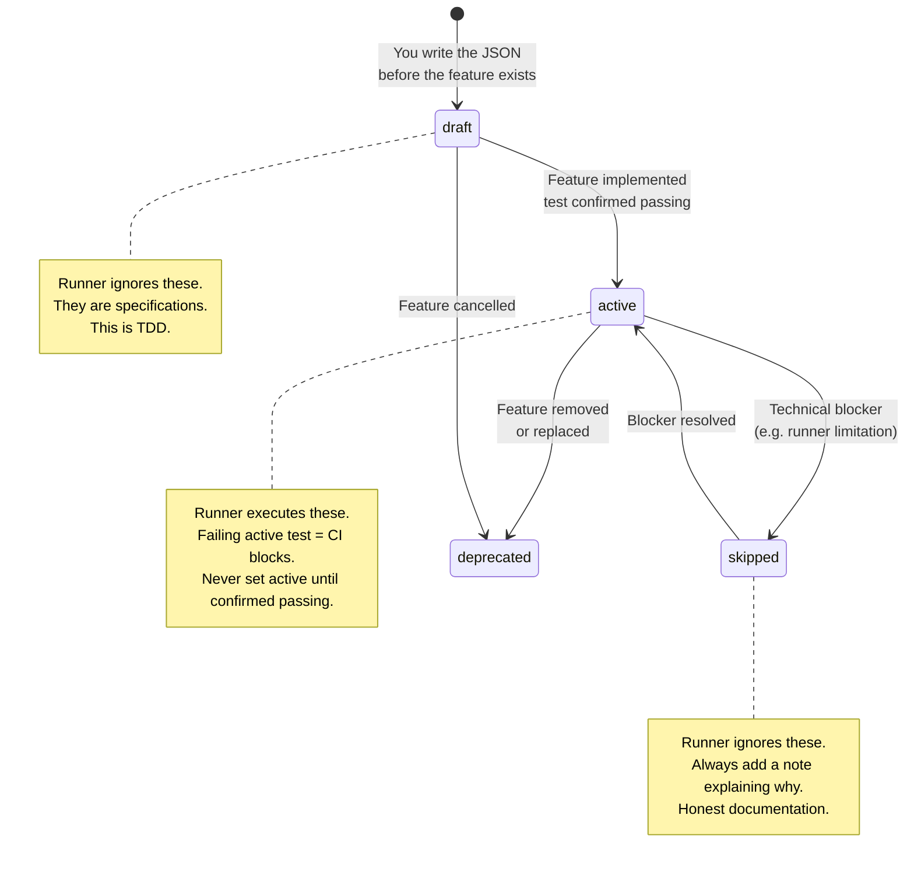
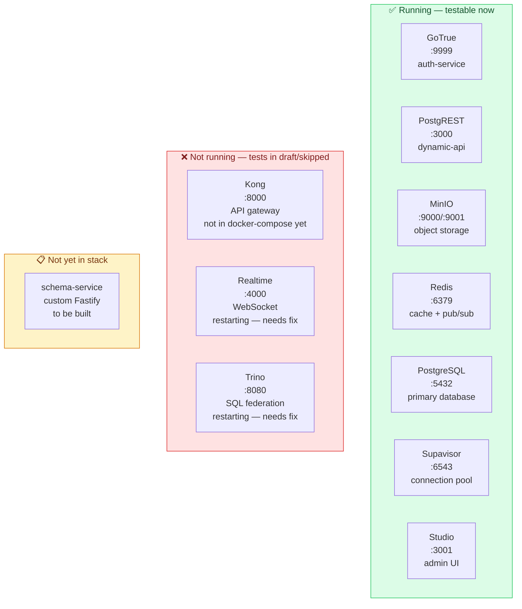
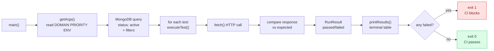
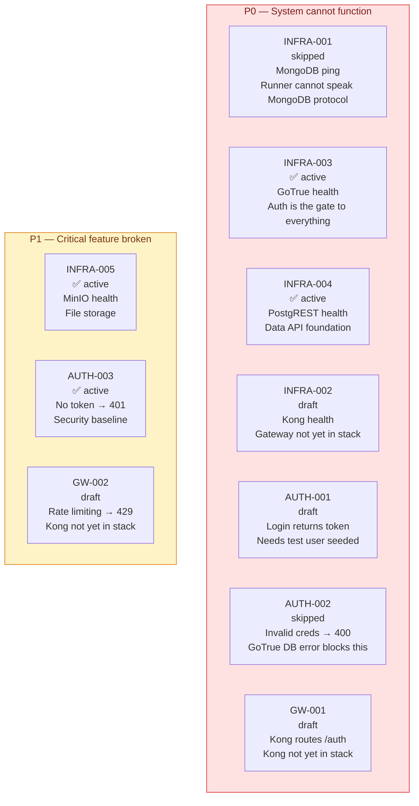
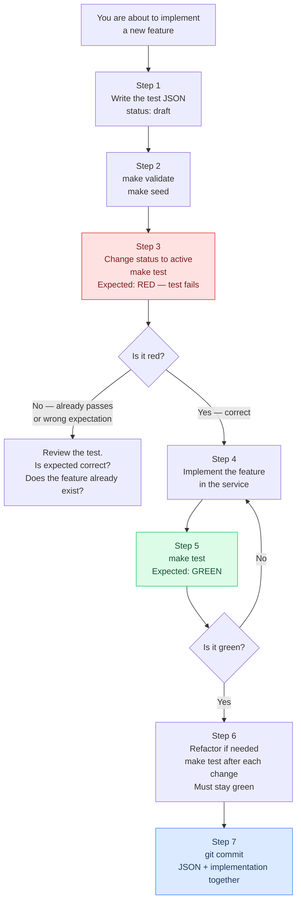
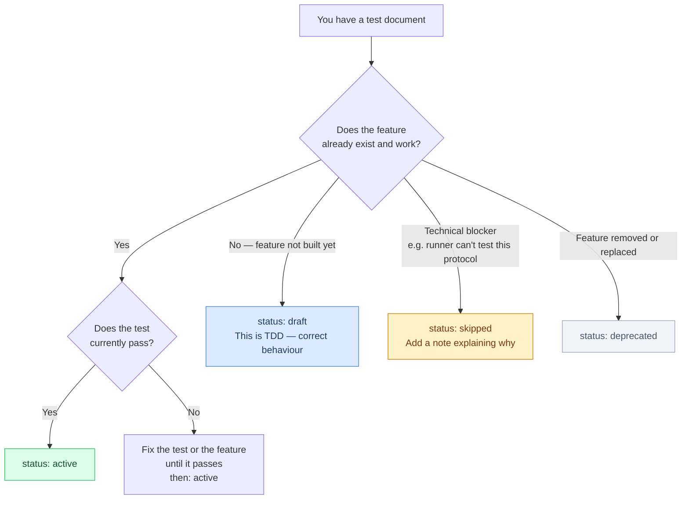
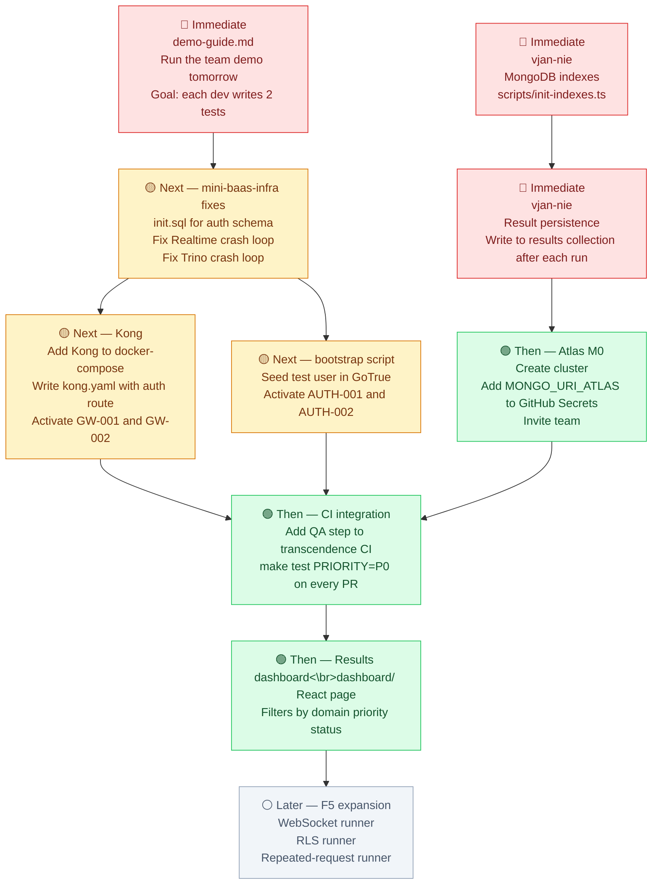

# Prismatica QA — Roadmap 1

*What we built, how it works, and where we go next.*

*March 2026 · Version 1.0 · vjan-nie*

---

## Table of Contents

- [1. What Changed Since Roadmap 0](#1-what-changed-since-roadmap-0)
- [2. What We Built in Phase 1](#2-what-we-built-in-phase-1)
- [3. The Complete System — How Everything Connects Now](#3-the-complete-system--how-everything-connects-now)
- [4. File by File — What Each New File Does](#4-file-by-file--what-each-new-file-does)
- [5. The Test Suite — Every Test Explained](#5-the-test-suite--every-test-explained)
- [6. Architectural Decisions Made This Session](#6-architectural-decisions-made-this-session)
- [7. How to Use This System Day to Day](#7-how-to-use-this-system-day-to-day)
- [8. Progress Against Original Objectives](#8-progress-against-original-objectives)
- [9. Next Steps](#9-next-steps)

---

## 1. What Changed Since Roadmap 0

Roadmap 0 left us with infrastructure but no execution. We had:
- ✅ MongoDB running locally via Docker
- ✅ JSON test definitions loading into MongoDB via `make seed`
- ✅ AJV schema validation via `make validate`
- ✅ One test document: `INFRA-001`
- ❌ No runner — tests existed in MongoDB but nothing executed them

This session closed that gap. We now have a working end-to-end pipeline:



---

## 2. What We Built in Phase 1

### 2.1 — The runner (`runner/src/cli.ts`)

The runner is the piece that was missing. It is a Node.js/TypeScript script that:

1. Reads CLI arguments (`DOMAIN`, `PRIORITY`, `ENV`)
2. Queries MongoDB for active tests matching those filters
3. For each test: makes one HTTP call
4. Compares the response against `expected`
5. Prints a pass/fail table to the terminal
6. Exits with code 1 if any test fails (CI-compatible)

### 2.2 — 9 new test documents

| ID | Domain | Status | What it tests |
|----|--------|--------|---------------|
| INFRA-002 | infra | draft | Kong proxy on :8000 |
| INFRA-003 | infra | active | GoTrue health on :9999 |
| INFRA-004 | infra | active | PostgREST health on :3000 |
| INFRA-005 | infra | active | MinIO health on :9000 |
| AUTH-001 | auth | draft | Login returns access_token |
| AUTH-002 | auth | skipped | Invalid credentials (GoTrue DB error) |
| AUTH-003 | auth | active | No token returns 401 |
| GW-001 | gateway | draft | Kong routes /auth to GoTrue |
| GW-002 | gateway | draft | Kong rate limiting returns 429 |

### 2.3 — Infrastructure diagnosis

During this session we discovered and fixed a real infrastructure problem: GoTrue was crash-looping because the `auth` schema did not exist in PostgreSQL. We diagnosed it from logs and fixed it with one command:

```bash
docker exec mini-baas-postgres psql -U postgres -d postgres \
  -c "CREATE SCHEMA IF NOT EXISTS auth;"
```

This is now documented as a precondition in `INFRA-003`.

### 2.4 — Two new documentation files

- `docs/ai-unblock-guide.md` — prompts for developers who are stuck
- `docs/demo-guide.md` — structured script for presenting the QA system to the team

---

## 3. The Complete System — How Everything Connects Now

### 3.1 — The full data flow



### 3.2 — The runner execution flow (one test)



### 3.3 — Test status lifecycle

Every test document has a `status` field. Understanding this lifecycle is essential for contributing correctly.



### 3.4 — The mini-baas-infra services and their current state



---

## 4. File by File — What Each New File Does

### `runner/src/cli.ts`

The heart of this session. A ~150-line TypeScript script with four sections:

**Section 1 — `getArgs()`**
Reads `DOMAIN`, `PRIORITY`, and `ENV` from either CLI arguments (`--domain=auth`) or environment variables. This is how `make test DOMAIN=auth` works — the Makefile passes `DOMAIN` as an env var, and `getArgs()` picks it up.

**Section 2 — `executeTest(test)`**
Takes one test document, builds an HTTP request from `url`, `method`, `headers`, and `payload`, calls `fetch()`, and compares the response against `expected.statusCode` and `expected.bodyContains`. Returns a `RunResult` with `passed`, `statusCode`, `duration_ms`, and `error`.

**Section 3 — `printResults(results)`**
Formats the results as a table in the terminal. Each row shows the test ID, HTTP status received, duration, title, and error reason if it failed. Exits with code 1 if any test failed — this is what makes CI block on failure.

**Section 4 — `main()`**
Orchestrates the three sections above. Connects to MongoDB, queries for active tests with the given filters, runs them sequentially, prints results, disconnects.



### `docs/ai-unblock-guide.md`

A practical reference for developers who do not know how to proceed. Contains:

- A didactic explanation of **red-green-refactor** translated into `make test` commands
- **Situation 1**: prompt to use when you cannot write a test in JSON
- **Situation 2**: prompt to use when the runner fails unexpectedly
- **Situation 3**: prompt to use when you cannot choose domain or priority
- A **minimum context block** to paste at the start of any new AI conversation

The key design decision: every prompt includes the complete architectural context so the AI gives project-specific answers, not generic testing advice.

### `docs/demo-guide.md`

A presenter script for the 15-20 minute team onboarding demo. Structured as timed blocks with exact terminal commands and suggested spoken words. Includes prepared answers to the five most likely questions from the team.

---

## 5. The Test Suite — Every Test Explained

### Why each test exists and what it proves



### The four active tests and what they verify

**INFRA-003 — GoTrue health**
`GET http://localhost:9999/health → 200, body contains "version"`
GoTrue is the authentication layer. If it is down, no user can log in and nothing else matters. This is the first test to run.
*Special note: requires `CREATE SCHEMA auth` in PostgreSQL before GoTrue starts. This is now a documented precondition.*

**INFRA-004 — PostgREST health**
`GET http://localhost:3000/ → 200`
PostgREST generates the entire data API from the PostgreSQL schema. If it is down, no data is readable or writable. This verifies the connection between PostgREST and PostgreSQL.

**INFRA-005 — MinIO health**
`GET http://localhost:9000/ → 403`
MinIO returns 403 (not 200) on unauthenticated root requests. This is correct behaviour — 403 means "MinIO is alive but you are not authenticated." A 200 here would actually be a security misconfiguration.

**AUTH-003 — No token returns 401**
`GET http://localhost:9999/user (no Authorization header) → 401`
This is a security baseline test. If a protected endpoint returns anything other than 401 when called without a token, the authentication layer is broken. Note: the correct GoTrue URL for this version (v2.188.1) is `/user`, not `/auth/v1/user`.

### The two skipped tests and why they are honest

**INFRA-001 — MongoDB ping**
MongoDB does not speak HTTP. The runner uses `fetch()` which is an HTTP client. Calling `mongodb://localhost:27017` with `fetch()` causes a network protocol error, not a meaningful test result. This test is skipped with a note explaining it needs a dedicated MongoDB ping script (Phase F5).

**AUTH-002 — Invalid credentials**
GoTrue is running but returns `500 Database error querying schema` when asked to authenticate. This means GoTrue's internal auth tables are not fully initialised — the `bootstrap.sh` script referenced in the State of the Art document has not been written yet. This test will be reactivated once that script exists.

### The four draft tests and what they specify

**INFRA-002 — Kong proxy**
Kong is not yet in the `mini-baas-infra` docker-compose. This test documents the expected behaviour when it is added: `GET http://localhost:8000/` should return 200.

**AUTH-001 — Login with valid credentials**
This test requires a test user to exist in the database (`test@prismatica.dev / TestPassword42!`). That user is created by a bootstrap script that does not exist yet. The test is ready to activate the moment that script runs.

**GW-001 — Kong routing**
Documents that Kong must forward `/auth` requests to GoTrue. When Kong is added to the stack and configured with `kong.yaml`, this test activates with no JSON changes — only the service needs to exist.

**GW-002 — Kong rate limiting**
Documents that the auth route must return 429 after exceeding the rate limit threshold. Note: this test also exposes a runner limitation — triggering a rate limit requires multiple rapid requests, not a single HTTP call. This will need runner support for repeated requests (Phase F5).

---

## 6. Architectural Decisions Made This Session

### Decision 6 — GoTrue requires a bootstrap step

**What we discovered:** GoTrue v2.188.1 tries to run migrations that create tables in the `auth` schema. If that schema does not exist, GoTrue crash-loops. The official Supabase stack handles this with an `init.sql` file mounted into PostgreSQL. Our stack does not have it.

**Temporary fix:** Manual `CREATE SCHEMA auth` command.

**Permanent fix needed:** Add an `init.sql` to `mini-baas-infra/scripts/` and mount it in the PostgreSQL service definition:

```yaml
postgres:
  volumes:
    - postgres-data:/var/lib/postgresql/data
    - ./scripts/init.sql:/docker-entrypoint-initdb.d/init.sql:ro
```

```sql
-- scripts/init.sql
CREATE SCHEMA IF NOT EXISTS auth;
CREATE SCHEMA IF NOT EXISTS storage;
CREATE SCHEMA IF NOT EXISTS extensions;
```

This is now a known dependency documented in INFRA-003's preconditions.

### Decision 7 — GoTrue URL paths differ from Supabase hosted

**What we discovered:** The State of the Art document references `/auth/v1/token` and `/auth/v1/user` as GoTrue endpoints. In practice, GoTrue v2.188.1 running standalone exposes `/token` and `/user` without the `/auth/v1` prefix.

**Impact:** AUTH-002 and AUTH-003 were written with the wrong URLs. AUTH-003 was corrected to `/user`. AUTH-002 remains skipped for a different reason (DB error).

**Rule going forward:** Always verify GoTrue endpoint URLs with `curl` before writing a test. The Supabase hosted version and the standalone Docker version may have different path prefixes.

### Decision 8 — MinIO 403 is a pass, not a fail

**What we decided:** `INFRA-005` expects `statusCode: 403`. This is intentional. MinIO's unauthenticated root request returns 403 as a sign that it is running and enforcing access control. If we expected 200, the test would always fail. If we expected anything other than 403, we would miss the case where MinIO is misconfigured to allow anonymous access.

**Rule going forward:** When writing smoke tests for services with authentication, always check what the unauthenticated response actually is before writing the `expected.statusCode`.

### Decision 9 — Sequential execution is sufficient for this scale

**What we discussed:** The runner executes tests one after another in a `for` loop. This is sequential, not parallel.

**Why this is fine now:** HTTP calls to local services take 2-50ms each. 10 tests = under 1 second. 100 tests = under 10 seconds.

**When to revisit:** When the suite exceeds ~200 tests and the full run takes more than 30 seconds. At that point, `Promise.all()` with `p-limit` gives parallel execution with concurrency control. The JSON test documents do not need to change — only the runner loop.

### Decision 10 — Tests that need state are draft, not skipped

**What we decided:** AUTH-001 needs a test user to exist. We wrote it as `draft` rather than `skipped`. The distinction matters:

- `skipped` = blocked by a technical limitation of the runner or infrastructure (may never be unblocked without significant work)
- `draft` = blocked by a missing precondition that will be satisfied in a normal implementation step

AUTH-001 becomes `active` the moment the bootstrap script seeds the test user. No JSON changes needed except `"status": "active"`.

---

## 7. How to Use This System Day to Day

### The TDD workflow — step by step

This is the cycle every developer should follow when implementing a new feature.



### The contribution workflow — quick reference

```bash
# 1. Create your test file
cp docs/test-template.json test-definitions/[domain]/[ID].json

# 2. Fill in the fields
# Required: id, title, domain, type, layer, priority, expected, status
# Start with status: "draft"

# 3. Validate
make validate
# Fix any errors shown, then:

# 4. Load into MongoDB
make seed

# 5. Run your domain
make test DOMAIN=[your domain]

# 6. Confirm it is red (if you wrote it before implementing)
# Then implement, then run again until green

# 7. Commit
git add test-definitions/[domain]/[ID].json
git commit -m "test([domain]): add [ID] [description]"
```

### Choosing status — the decision tree



### Running tests — all the options

```bash
# Full active suite
make test

# By domain
make test DOMAIN=auth
make test DOMAIN=gateway
make test DOMAIN=infra
make test DOMAIN=api
make test DOMAIN=realtime
make test DOMAIN=storage

# By priority (use P0 before every merge)
make test PRIORITY=P0
make test PRIORITY=P1

# Combined
make test DOMAIN=auth PRIORITY=P0

# Against staging
make test ENV=staging
```

### Before opening a pull request — always

```bash
make test PRIORITY=P0
```

If any P0 test fails, do not open the PR. Fix the issue first.

### When you are stuck — use the AI guide

`docs/ai-unblock-guide.md` has three prompt templates:

| Situation | Prompt to use |
|-----------|---------------|
| Cannot write the test in JSON | Situation 1 |
| Runner fails and you don't know why | Situation 2 |
| Don't know which domain or priority | Situation 3 |

Always paste the **minimum context block** at the start of any new AI conversation. Without it, the AI gives generic advice that does not apply to this project.

---

## 8. Progress Against Original Objectives

### Phase F0 — MongoDB infrastructure setup

| Task | Owner | Status |
|------|-------|--------|
| MongoDB local via Docker (`mongo:7`) | vjan-nie | ✅ Done |
| Create `test_hub` database with 4 collections | vjan-nie | ✅ Done |
| Unique index on id field (correctness) | vjan-nie | ⏳ Pending — do before team contributes |
| Performance indexes (domain, priority, results) | vjan-nie | ⏳ Low priority — needed at 100+ tests |
| Read-only user for team, write user for runner | vjan-nie | ⏳ Pending |
| Document connection string in `.env.example` | Both | ✅ Done |

### Phase F1 — First test documents and schema validation

| Task | Owner | Status |
|------|-------|--------|
| Define official JSON Schema (AJV) | dlesieur | ✅ Done |
| Write 5–10 smoke tests (AUTH, GW, INFRA) | dlesieur | ✅ Done — 10 tests across 3 domains |
| Create "How to add a test" guide | dlesieur | ✅ Done |
| Create AI unblocking guide | dlesieur | ✅ Done — added this session |
| Review schema with team (30 min session) | Both | ⏳ Pending — demo tomorrow |

### Phase F2 — Generic runner

| Task | Owner | Status |
|------|-------|--------|
| Node.js/TypeScript script that reads MongoDB and calls HTTP | vjan-nie → dlesieur | ✅ Done — built this session |
| Support GET/POST with payload and expected.statusCode | dlesieur | ✅ Done |
| Support expected.bodyContains | dlesieur | ✅ Done |
| CLI: `--domain=auth --priority=P1 --env=local` | dlesieur | ✅ Done |
| Terminal output: pass/fail table with duration | dlesieur | ✅ Done |
| Persist results to MongoDB `results` collection | vjan-nie | ⏳ Pending |

### Phase F3 — CI integration and team training

| Task | Owner | Status |
|------|-------|--------|
| GitHub Actions step in `transcendence` CI | Both | ⏳ Pending |
| Team training session (demo) | dlesieur | 🔄 Tomorrow |
| Each dev adds minimum 2 tests | Team | ⏳ Pending |

### Phase F4 — Results dashboard

| Task | Owner | Status |
|------|-------|--------|
| React page at `:3003` showing results from MongoDB | vjan-nie | ⏳ Pending |
| Filters by domain · priority · status · last_run.passed | vjan-nie | ⏳ Pending |
| Optional: trend chart pass/fail by day | vjan-nie | ⏳ Pending |

### Phase F5 — Expansion and automation

| Task | Owner | Status |
|------|-------|--------|
| Runner support for Realtime (WebSocket) tests | dlesieur | ⏳ Pending |
| Runner support for RLS (PostgREST) tests | dlesieur | ⏳ Pending |
| Runner support for MinIO presigned URL tests | dlesieur | ⏳ Pending |
| Runner support for repeated requests (rate limiting) | dlesieur | ⏳ Pending |
| Tag tests by migration phase | dlesieur | ✅ Done — `phase` field in schema |
| Pre-commit hook: run domain tests on service change | dlesieur | ⏳ Pending |
| README badges: % tests passing per domain | dlesieur | ⏳ Pending |
| MongoDB ping test (non-HTTP runner) | dlesieur | ⏳ Pending |
| Bootstrap script: seed test user for AUTH-001 | Both | ⏳ Pending |
| init.sql for mini-baas-infra PostgreSQL | vjan-nie | ⏳ Pending |

---

## 9. Next Steps



### Immediate — vjan-nie

**MongoDB indexes** (`scripts/init-indexes.ts`):
```typescript
// Do this before the team demo — correctness, not performance
await tests.createIndex({ id: 1 }, { unique: true })

// Do this when the suite reaches 100+ tests
await tests.createIndex({ domain: 1, priority: 1, status: 1 })
await results.createIndex({ test_id: 1, executed_at: -1 })
await results.createIndex({ passed: 1, environment: 1, executed_at: -1 })
```

**Result persistence** — add to `runner/src/cli.ts` after `printResults()`:
```typescript
const { results: resultsCol } = await getDb()
await resultsCol.insertMany(results.map(r => ({
  test_id:           r.test.id,
  run_by:            "developer",
  environment:       env,
  executed_at:       new Date(),
  passed:            r.passed,
  duration_ms:       r.duration_ms,
  http_status:       r.statusCode,
  error:             r.error,
})))
```

### Immediate — mini-baas-infra (vjan-nie)

Create `scripts/init.sql` and mount it in PostgreSQL:
```sql
CREATE SCHEMA IF NOT EXISTS auth;
CREATE SCHEMA IF NOT EXISTS storage;
CREATE SCHEMA IF NOT EXISTS extensions;
```

This prevents the GoTrue bootstrap problem from recurring on a fresh clone.

### Next — Kong (both)

Once Kong is added to the docker-compose, three things happen automatically:
1. Change `INFRA-002` status from `draft` to `active`
2. Change `GW-001` status from `draft` to `active`
3. Write the `kong.yaml` configuration that makes GW-001 pass

The tests already describe exactly what Kong must do. The implementation follows the specification.

### Next — Bootstrap script (both)

A `scripts/bootstrap.sh` that:
1. Creates the `auth` schema in PostgreSQL (permanent fix)
2. Seeds a test user via GoTrue Admin API
3. Seeds initial `system.*` tables

When this exists, AUTH-001 and AUTH-002 can be set to `active`.

### Then — Atlas M0 and CI

Once result persistence exists and Atlas is set up, the CI step in `transcendence` runs automatically on every PR:

```yaml
- name: Run QA smoke suite
  run: |
    git clone https://github.com/Univers42/QA.git
    cd QA
    cp .env.example .env
    npm install
    make test PRIORITY=P0
  env:
    MONGO_URI: ${{ secrets.MONGO_URI_ATLAS }}
    KONG_URL: http://localhost:8000
    GOTRUE_URL: http://localhost:9999
```

---

*This document reflects the state of `prismatica-qa` as of March 22, 2026.*
*Update it when a phase is completed or a decision changes.*
*Previous: [roadmap-0.md](roadmap-0.md) · Main README: [README.md](README.md)*
