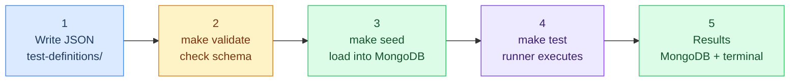
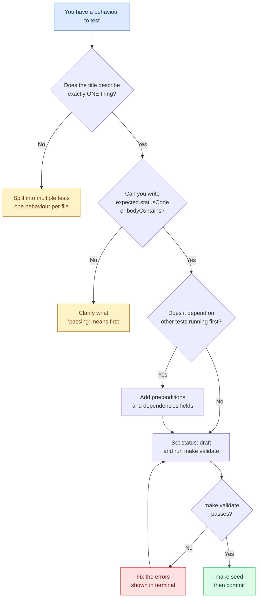

# How to Add a Test

This guide explains how to write a test definition for the Prismatica QA Test Hub. No prior testing framework knowledge required — a test is just a JSON file that describes what should happen when a service is called.

---

## The core idea

In most testing frameworks, tests are code. Here, **tests are data**. You describe the expected behaviour in a JSON document. The runner reads that document, makes the HTTP call, and checks the response. You never touch the runner code to add a new test.

If you do not want to write the JSON manually, use:

```bash
python3 -m prismatica_qa add
```

The CLI asks only the minimum fields, generates the next ID automatically, writes the JSON in the correct folder and can sync it to MongoDB / Atlas.



---

## Step 1 — Pick the right domain and ID

Every test belongs to one domain. The domain determines where the file lives and what prefix the ID uses.

| Domain | Folder | ID prefix | What it tests |
|--------|--------|-----------|---------------|
| `auth` | `test-definitions/auth/` | `AUTH-` | GoTrue — login, OAuth, JWT, sessions |
| `gateway` | `test-definitions/gateway/` | `GW-` | Kong — routing, rate limiting, CORS |
| `schema` | `test-definitions/schema/` | `SCH-` | schema-service — collections, fields, DDL |
| `api` | `test-definitions/api/` | `API-` | PostgREST — endpoints, filters, RLS |
| `realtime` | `test-definitions/realtime/` | `RT-` | Supabase Realtime — WebSocket |
| `storage` | `test-definitions/storage/` | `STG-` | MinIO — file upload, presigned URLs |
| `ui` | `test-definitions/ui/` | `UI-` | React frontend — components, hooks |
| `infra` | `test-definitions/infra/` | `INFRA-` | Docker, health checks, infrastructure |

**ID format:** `DOMAIN-NNN` where NNN is a zero-padded number. Look at the existing files in the folder and use the next available number.

```
AUTH-001.json   ← exists
AUTH-002.json   ← exists
AUTH-003.json   ← yours, use id: "AUTH-003"
```

---

## Step 2 — Copy the template

```bash
cp docs/test-template.json test-definitions/auth/AUTH-003.json
```

---

## Step 3 — Fill in the fields

Open the file and fill in each field. Here is what every field means:

### Required fields

These eight fields must always be present. `make validate` will reject the file if any are missing.

| Field | Type | Description | Example |
|-------|------|-------------|---------|
| `id` | string | Unique identifier. Format: `DOMAIN-NNN` | `"AUTH-003"` |
| `title` | string | One sentence: what should happen. Start with the subject. | `"Login with valid credentials returns access token"` |
| `domain` | string | One of the 8 domains above | `"auth"` |
| `type` | string | `unit` · `integration` · `e2e` · `smoke` · `contract` | `"integration"` |
| `layer` | string | `backend` · `frontend` · `infra` · `full-stack` | `"backend"` |
| `priority` | string | `P0` · `P1` · `P2` · `P3` (see below) | `"P1"` |
| `expected` | object | What a passing response looks like | `{ "statusCode": 200 }` |
| `status` | string | `active` · `draft` · `deprecated` · `skipped` | `"draft"` |

**Priority guide:**

| Priority | Meaning | Effect in CI |
|----------|---------|--------------|
| `P0` | System cannot function without this | Blocks merge |
| `P1` | Critical feature broken | Blocks merge |
| `P2` | Degraded experience | Warning only |
| `P3` | Nice to have | Report only |

### Optional but recommended fields

| Field | Type | Description |
|-------|------|-------------|
| `description` | string | Full explanation of what this test verifies and why it matters |
| `service` | string | The service name under test (`auth-service`, `dynamic-api`, etc.) |
| `tags` | array | Keywords for filtering (`["oauth", "jwt", "42school"]`) |
| `preconditions` | array | What must be true before this test runs (`["GoTrue running on :9999"]`) |
| `dependencies` | array | Services that must be up (`["postgres", "redis"]`) |
| `url` | string | The endpoint being called |
| `method` | string | HTTP method: `GET` · `POST` · `PATCH` · `DELETE` |
| `payload` | object | Request body for POST/PATCH requests |
| `headers` | object | Additional HTTP headers |
| `phase` | string | Migration phase this test belongs to (`"phase-0"`, `"phase-1"`, etc.) |
| `author` | string | Your 42 login |
| `notes` | string | Anything a future reader needs to know |

### The `expected` object

This is what the runner checks. You can use any combination of these:

```json
"expected": {
  "statusCode": 200,
  "bodyContains": ["access_token", "refresh_token"],
  "jwtClaims": {
    "role": "authenticated",
    "exp_offset_min": 3540
  },
  "cookieSet": "sb-refresh-token"
}
```

| Key | Meaning |
|-----|---------|
| `statusCode` | Expected HTTP status code |
| `bodyContains` | Array of strings that must appear in the response body |
| `jwtClaims` | Fields that must exist in the decoded JWT payload |
| `cookieSet` | Name of a cookie that must be set in the response |

---

## Step 4 — A complete example

Here is a real test document from start to finish:

```json
{
  "id": "AUTH-003",
  "title": "Login with valid credentials returns access token",
  "description": "POST to GoTrue token endpoint with correct email and password. The response must contain access_token and refresh_token. The access_token must be a valid JWT with role=authenticated and exp = now + 3600 seconds.",
  "domain": "auth",
  "type": "integration",
  "layer": "backend",
  "priority": "P1",
  "tags": ["gotrue", "jwt", "login", "password"],
  "service": "auth-service",
  "component": "GoTrue",
  "environment": ["local", "staging"],
  "dependencies": ["postgres"],
  "preconditions": [
    "GoTrue running on :9999",
    "Test user exists: test@prismatica.dev / TestPassword123!"
  ],
  "expected": {
    "statusCode": 200,
    "bodyContains": ["access_token", "refresh_token", "token_type"]
  },
  "url": "http://localhost:9999/auth/v1/token?grant_type=password",
  "method": "POST",
  "headers": {
    "Content-Type": "application/json"
  },
  "payload": {
    "email": "test@prismatica.dev",
    "password": "TestPassword123!"
  },
  "timeout_ms": 5000,
  "retries": 1,
  "author": "dlesieur",
  "phase": "phase-1",
  "status": "draft",
  "notes": "Set status to active once the test user seed is confirmed in the local bootstrap script."
}
```

---

## Step 5 — Validate and seed

```bash
# Check the JSON is valid against the schema
make validate

# Load it into MongoDB
make seed
```

`make validate` output when everything is correct:
```
  +  OK       AUTH-003        test-definitions/auth/AUTH-003.json
  -------------------------------------------
  Valid   : 3
  Invalid : 0
  Total   : 3
  -------------------------------------------
```

If a field is wrong, the validator tells you exactly what failed:
```
  ✗  INVALID  AUTH-003        test-definitions/auth/AUTH-003.json
             /priority: must be equal to one of the allowed values
```

---

## Step 6 — Commit the file

The JSON file is the source of truth. MongoDB is the execution engine. **Always commit the JSON.**

```bash
git add test-definitions/auth/AUTH-003.json
git commit -m "test(auth): add AUTH-003 login with valid credentials"
```

Commit format follows [Conventional Commits](https://www.conventionalcommits.org/):
`test(domain): description`

---

## Common mistakes

**Test is too broad.**
`"The authentication system works correctly"` — this cannot be automated and does not tell you what failed.
Write one test per observable behaviour: `"Login with banned account returns 403"`.

**Missing preconditions.**
If your test needs a user to exist in the database, write that in `preconditions`. Otherwise the test will fail for the wrong reason and waste debugging time.

**Wrong status.**
New tests should start as `"draft"`. Change to `"active"` only once you have confirmed the test passes against a running environment. A failing `"active"` test in CI blocks everyone.

**ID already taken.**
Check the folder before picking a number. Duplicate IDs cause the seed to silently overwrite the existing test.

---

## Flowchart: is your test well-defined?



---

*For the full test schema reference, see `docs/test-template.json`.*
*For architecture and CI integration, see `README.md`.*
