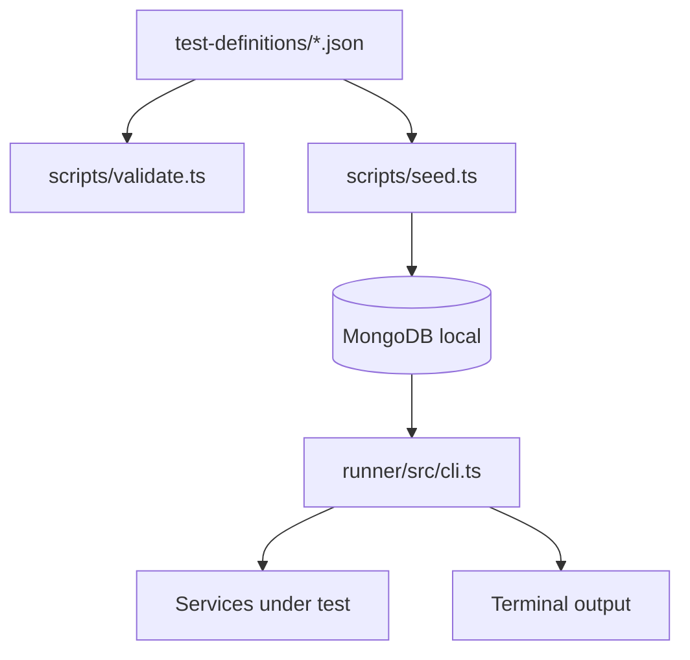

# Prismatica QA — Roadmap 1

*Legacy baseline of the first end-to-end QA pipeline.*

*March 2026 · Historical reference · Superseded by Roadmap 2*

---

## Purpose

This document is no longer the recommended target architecture. It exists to record what the first usable version of the QA system achieved, where it worked well, and where it started to break down.

Roadmap 1 matters because it introduced the core ideas that still survive:
- tests are data
- test definitions live in git
- MongoDB is useful as an execution store
- status and priority are part of the test lifecycle, not an afterthought

It is also the phase we deliberately move beyond in [2-roadmap.md](./2-roadmap.md).

---

## What V1 Achieved

Roadmap 1 delivered the first complete loop:

1. Write JSON test definitions in `test-definitions/`
2. Validate them with AJV
3. Seed them into local MongoDB
4. Execute active tests with a TypeScript runner
5. Print pass/fail output in the terminal

That was the first moment the repository became operational instead of just descriptive.

### V1 capabilities

| Capability | Status in V1 |
|-----------|---------------|
| JSON test definitions in git | Implemented |
| Local MongoDB via Docker | Implemented |
| Schema validation | Implemented with AJV |
| HTTP test execution | Implemented |
| Domain and priority filtering | Implemented |
| Result comparison against previous runs | Not implemented |
| Interactive authoring | Not implemented |
| Bash/manual test execution | Not implemented |
| Canonical model for multiple test kinds | Not implemented |

---

## V1 Architecture

This was simple and effective for a small number of HTTP smoke tests.

---

## What Worked Well

### 1. JSON in git as source of truth

This was the correct decision and remains correct.

Definitions in git give:
- reviewable changes
- branch-safe evolution
- history and blame
- a low-tech backup if Mongo is dropped or rebuilt

### 2. Local MongoDB as execution store

This was also useful and remains useful.

Even in local-only mode, MongoDB helps with:
- execution filtering
- result persistence
- last-run comparison
- future dashboards and reporting

### 3. Status lifecycle

The `draft -> active -> skipped/deprecated` lifecycle was one of the strongest ideas from V1.

It lets the team separate:
- tests that specify intended behaviour
- tests that are safe to execute automatically
- tests blocked by technical limitations

### 4. Domain and priority as first-class concepts

These fields made it possible to treat tests as an operational suite rather than isolated files.

That remains essential for:
- smoke runs
- merge gates
- focused execution by subsystem

---

## Structural Limits of V1

V1 became difficult to scale for five reasons.

### 1. The schema tried to describe too many things with one shape

Every test shared roughly the same shape, even when the execution model was different.

That worked for HTTP-only tests, but it does not scale when you need:
- shell checks
- manual verification
- future websocket or multi-step flows

### 2. `type` and `layer` were overloaded

The old schema mixed together:
- what a test is
- how a test runs
- where it belongs architecturally

Those are different axes and should not be collapsed into one field model.

### 3. Manual JSON authoring was too expensive

The team feedback was valid: if adding one test requires too much low-level JSON editing, adoption drops.

The problem was not JSON itself.
The problem was forcing humans to hand-author the full shape every time.

### 4. The runner was HTTP-only by design

That blocked several realistic QA cases:
- infrastructure checks that are easier in shell
- manual UI checks
- non-HTTP protocols

### 5. The code and the docs drifted

Once the repository started evolving toward Python and a better model, V1 documentation became misleading.

That is the main reason this document is now explicitly marked as legacy.

---

## Lessons We Keep

Roadmap 1 is not discarded. Its useful lessons are retained.

### Keep

- JSON in git is the source of truth
- local MongoDB is an execution and history store
- domain, priority, and status are mandatory concepts
- one command should be enough to sync and run
- test definitions should remain human-readable

### Do not keep

- TypeScript as the main QA automation language
- one oversized schema for every test kind
- HTTP-only execution as the default assumption
- documentation that describes architecture no longer present in the repo

---

## Why Roadmap 2 Replaces It

Roadmap 2 is the recommended path because it resolves the scaling problems without throwing away the good parts.

The replacement strategy is:
- keep JSON in git as source of truth
- keep Mongo local as execution store
- move automation to Python
- define a minimal shared base model
- derive specific models for `http`, `bash`, and `manual`
- canonicalize old definitions during sync and execution

That is the right upgrade path because it preserves compatibility while cleaning the model.

---

## Final Status of Roadmap 1

Roadmap 1 should now be read as:
- the first successful QA milestone
- a historical baseline
- a list of lessons learned

It should not be read as the target state of the repository.

The target state is documented in [2-roadmap.md](./2-roadmap.md).

---

## Summary

Roadmap 1 proved that the QA repository could work end to end.

It also proved that the original model would become expensive to maintain if it stayed:
- HTTP-only
- Node-first
- hand-authored JSON heavy
- single-shape for all test kinds

That is why the system now evolves toward the Python, local-first, canonical-model architecture defined in Roadmap 2.
