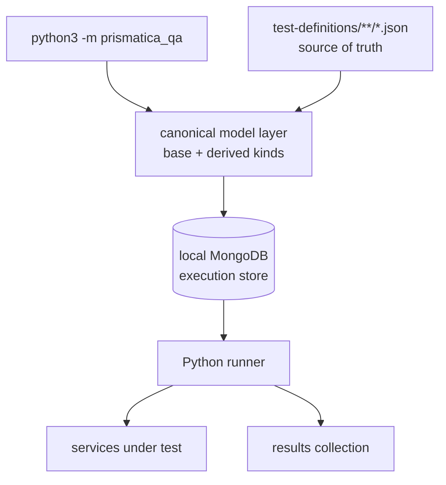

# Prismatica QA — Roadmap 2

*Current recommended architecture: Python, JSON-first, local-first, scalable by test kind.*

*March 2026 · Working strategy · This document supersedes Roadmap 1*

---

## Executive Summary

The most convenient, scalable, and realistic direction for this repository is:

- JSON in git remains the source of truth
- local MongoDB remains the execution and history store
- Python is the automation language
- the canonical schema uses a minimal base model plus derived test kinds
- `type` means execution kind: `http`, `bash`, `manual`
- `layer` is optional classification: `unit`, `integration`, `e2e`, `contract`, `smoke`
- the CLI is the normal way to add, sync, and run tests
- Atlas is optional later, not a dependency for normal team use today

This is the architecture that best fits the current repository, the current team workflow, and the current codebase.

---

## Design Principles

### 1. Git owns the definitions

The repository must remain usable with only:
- a clone of the repo
- Docker for local MongoDB
- Python dependencies

That means test definitions live first in `test-definitions/`.

### 2. MongoDB is an execution store, not the only source of truth

MongoDB is still valuable, but local-only mode is the correct default now.

MongoDB stores:
- synchronized test definitions
- execution history
- last-run comparison data

If Mongo is lost, the definitions can always be rebuilt from git.

### 3. One model for all tests is the wrong abstraction

The schema must separate:
- what every test needs
- what only one test kind needs

That is why the system now uses:
- a minimal base model
- derived models for `http`, `bash`, and `manual`

### 4. The CLI should remove busywork, not hide the data model

The CLI is there to:
- reduce manual JSON editing
- ask only the necessary questions
- generate canonical JSON
- sync to Mongo automatically

It should not invent a second hidden model.

### 5. Backward compatibility matters during migration

Existing test definitions must keep working while the repository converges on the new schema.

That is why sync and execution canonicalize legacy documents instead of failing immediately on old fields.

---

## Current Recommended Architecture



### Practical flow

1. The user adds or edits a test through the CLI
2. The CLI builds a canonical document
3. That document is written to JSON in the repo
4. The CLI syncs valid JSON definitions into local MongoDB
5. The runner reads from MongoDB
6. The runner persists execution results back to MongoDB

This gives:
- versioned definitions
- fast filtered execution
- persistent local history

---

## Canonical Test Model

### Base model

Every test can be valid with only these five fields:

```python
id
title
domain
priority
status
```

This is intentional.

It allows:
- manual tests
- documentation-first tests
- draft specifications for not-yet-implemented features

### Derived test kinds

#### HTTP

```json
{
  "id": "AUTH-042",
  "title": "Valid login returns token",
  "domain": "auth",
  "priority": "P1",
  "status": "draft",
  "type": "http",
  "layer": "integration",
  "url": "http://localhost:9999/auth/v1/token",
  "method": "POST",
  "expected": {
    "statusCode": 200,
    "bodyContains": ["access_token"]
  }
}
```

HTTP-specific fields:
- `type: "http"`
- `url`
- `method`
- `expected.statusCode`

Optional HTTP fields:
- `headers`
- `payload`
- `expected.bodyContains`
- `expected.jsonPath`

#### Bash

```json
{
  "id": "INFRA-006",
  "title": "PostgreSQL accepts connections on :5432",
  "domain": "infra",
  "priority": "P0",
  "status": "active",
  "type": "bash",
  "script": "pg_isready -h localhost -p 5432 -U postgres",
  "expected_exit_code": 0
}
```

Bash-specific fields:
- `type: "bash"`
- `script`

Optional Bash fields:
- `expected_exit_code`
- `expected_output`
- `timeout_seconds`

#### Manual

```json
{
  "id": "UI-001",
  "title": "Login form shows inline validation on empty input",
  "domain": "ui",
  "priority": "P2",
  "status": "draft",
  "type": "manual",
  "notes": "Verify the inline validation message appears before form submit"
}
```

Manual-specific fields:
- no additional required fields

Optional manual fields:
- `type: "manual"`
- `notes`

### Common optional fields

Any test kind may also include:
- `tags`
- `phase`
- `layer`
- `environment`
- `preconditions`
- `notes`

---

## Why This Model Is Optimal

This model is the best current compromise between simplicity and future growth.

### Better than the old schema

It avoids forcing every test to carry fields that do not apply.

Examples:
- a bash test does not need an HTTP `expected` object
- a manual test does not need fake request fields
- a base-only draft remains valid and useful

### Better than Atlas-first today

The team does not currently want Atlas as a hard dependency.

That means the system must work well when:
- persistence is local
- the repo is the collaboration backbone
- users must pull the latest branch manually

JSON-first and local MongoDB fit that reality.

### Better than over-engineering the CLI

The current package layout is small and direct:

```
prismatica_qa/
├── cli.py
├── models.py
├── files.py
├── mongo.py
├── runner.py
├── env.py
└── catalog.py
```

That is the right scale for the repository right now.

Splitting into many nested packages and subcommands would add ceremony without solving the actual problem.

---

## Current Runtime Model

### `add`

`python3 -m prismatica_qa add`

Recommended behavior:
- prompt for base fields
- prompt only for the selected test kind
- generate next ID from JSON files
- canonicalize the document
- write JSON
- optionally sync to MongoDB local

### `sync`

`python3 -m prismatica_qa sync`

Recommended behavior:
- read JSON files
- validate and canonicalize each definition
- upsert valid tests into MongoDB local
- report invalid definitions clearly

### `run`

`python3 -m prismatica_qa run`

Recommended behavior:
- sync JSON to MongoDB by default
- query active tests from MongoDB with filters
- compare each result against the latest stored result
- persist new results

Execution semantics:
- `http` tests can run in parallel
- `bash` tests can run in parallel with sensible limits
- `manual` tests should run sequentially and interactively

### `export`

`python3 -m prismatica_qa export`

Recommended behavior:
- read definitions from MongoDB local
- write canonical JSON back to disk
- use only when you explicitly need to regenerate files from Mongo state

In normal use, `add` should already produce the JSON directly.

---

## Backward Compatibility Strategy

The repository already contains legacy documents from the older schema.

The correct strategy is not “break them all now”.

The correct strategy is:

1. Accept legacy fields during sync and run
2. Canonicalize them into the new model
3. Export canonical JSON gradually
4. Remove legacy branches only after the repo is migrated cleanly

### Compatibility rules

Examples of supported legacy translation:
- legacy `executor: "script"` becomes `type: "bash"`
- legacy `type: "integration"` may become `layer: "integration"` if the actual execution kind is detected from fields
- legacy HTTP `expected.statusCode` and `expected.bodyContains` remain valid
- legacy bash `expected.exitCode` can map to `expected_exit_code`

This is the least disruptive migration path.

---

## Scalability Plan

Scalability here means:
- more tests
- more test kinds
- less friction for contributors
- more reliable execution history

It does not mean adding distributed complexity too early.

### Phase 2.1 — Stabilize the schema and docs

Goal:
- one canonical model everywhere

Tasks:
- finish aligning docs with the new base/derived model
- remove old wording that still describes the HTTP-only schema as current
- ensure template, README, and how-to docs all match the same contract

### Phase 2.2 — Harden the CLI

Goal:
- make authoring genuinely low friction

Tasks:
- improve prompts by test kind
- prefill defaults from domain where useful
- support `--quick` non-interactive creation for scripts and CI
- improve error messages for invalid JSON payloads and assertions

### Phase 2.3 — Improve execution fidelity

Goal:
- support richer assertions without changing the model again

Tasks:
- extend HTTP assertions carefully
- support safer bash execution conventions
- add better reporting for manual tests
- persist more useful snapshots on failure

### Phase 2.4 — Add suite semantics

Goal:
- run groups of tests intentionally

Tasks:
- define suite/group documents in MongoDB or JSON
- allow running by suite in addition to domain, type, layer, priority
- keep suite definitions simple and composable

### Phase 2.5 — CI and optional shared persistence

Goal:
- scale beyond individual laptops without forcing it locally

Tasks:
- use the Python runner in CI
- keep local mode default
- introduce Atlas only as an optional shared backend when the team actually needs shared operational state

Atlas should be a scaling step, not a design assumption.

### Phase 2.6 — Reporting and dashboard

Goal:
- make result history observable

Tasks:
- expose pass/fail trends from MongoDB results
- show regressions and fixes by run
- filter by domain, type, layer, priority, environment

---

## Decisions

### Decision 1 — Keep JSON as source of truth

Reason:
- branch-safe
- reviewable
- recoverable
- works without network

### Decision 2 — Keep local MongoDB as the normal store

Reason:
- enough for current scale
- keeps the tool usable offline
- supports execution history and last-run comparison

### Decision 3 — Use `type` for execution kind

Reason:
- `http`, `bash`, `manual` are mutually exclusive execution modes

### Decision 4 — Use `layer` for classification

Reason:
- `unit`, `integration`, `e2e`, `contract`, `smoke` are categorization labels, not execution modes

### Decision 5 — Canonicalize instead of hard-breaking legacy tests

Reason:
- migration should be progressive
- the team already has definitions in the old shape

### Decision 6 — Do not make Atlas primary yet

Reason:
- the current team workflow is explicitly local-first
- requiring Atlas now would increase fragility and setup cost

---

## Non-Goals Right Now

These are not the right immediate priorities:

- making Atlas mandatory
- splitting the Python package into a large framework
- introducing plugin systems before the base model stabilizes
- replacing JSON with Mongo-only authoring
- rebuilding the whole repo around a dashboard first

---

## Success Criteria

Roadmap 2 is successful when all of this is true:

1. A new contributor can add a valid `http`, `bash`, or `manual` test through the CLI in under two minutes
2. The JSON written by the CLI is canonical and reviewable
3. `run` can filter by `domain`, `type`, `layer`, `priority`, and `status`
4. Existing legacy definitions still execute after canonicalization
5. Local MongoDB stores result history and last-run comparison reliably
6. The documentation no longer contradicts the implementation

---

## Immediate Next Steps

### High priority

- finish aligning repository docs with the canonical model
- keep migrating legacy JSON definitions toward canonical output
- validate that all active tests still execute correctly through the Python path
- decide whether `export` remains necessary in JSON-first mode or should become secondary tooling

### Medium priority

- improve CLI quick mode
- add suite/group execution
- refine assertion support

### Later

- optional Atlas support
- CI integration at scale
- dashboard/reporting improvements

---

## Final Position

The optimal architecture for this repository today is not:
- the original TypeScript HTTP-only pipeline
- nor an Atlas-first redesign that assumes shared infrastructure from day one

The optimal architecture is:
- Python
- JSON-first
- local-first
- canonical model with derived test kinds
- MongoDB local for execution and results
- optional shared persistence later

That is the most practical, scalable, and maintainable path from the current state of the codebase.
