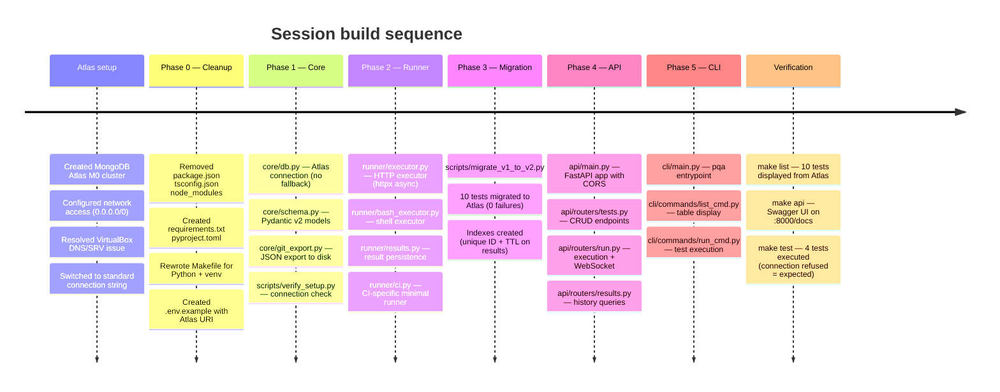
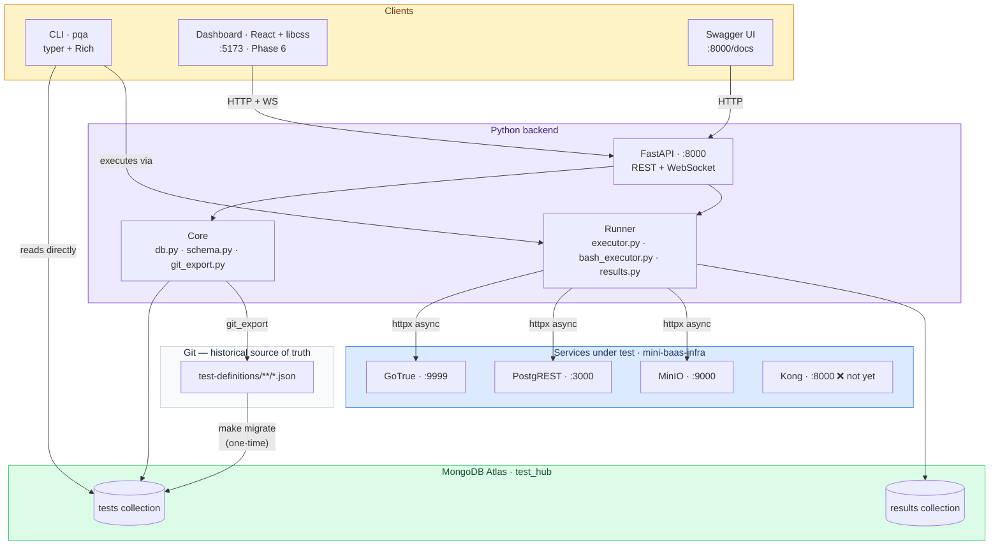
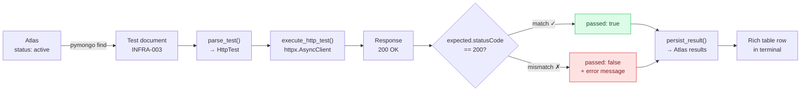
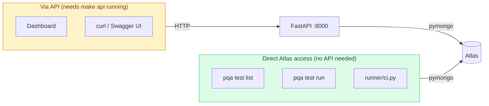
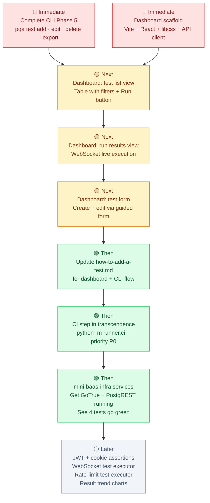

# Prismatica QA — Roadmap 4

*From Node.js to Python + FastAPI: the migration that actually happened.*

*March 2026 · Version 1.0 · dlesieur & vjan-nie*

---

## Table of Contents

- [1. What Changed Since Roadmap 1](#1-what-changed-since-roadmap-1)
- [2. What We Built in This Session](#2-what-we-built-in-this-session)
- [3. The Complete System — How Everything Connects Now](#3-the-complete-system--how-everything-connects-now)
- [4. File by File — What Each New File Does](#4-file-by-file--what-each-new-file-does)
- [5. Architectural Decisions Made This Session](#5-architectural-decisions-made-this-session)
- [6. How to Use This System Day to Day](#6-how-to-use-this-system-day-to-day)
- [7. Progress Against Objectives](#7-progress-against-objectives)
- [8. Next Steps](#8-next-steps)

---

## 1. What Changed Since Roadmap 1

Roadmap 1 left us with a working but limited pipeline: a TypeScript runner, 10 JSON tests, 4 passing against live services, and terminal-only output. Roadmap 2 proposed migrating to Python with a CLI and Atlas, but was never implemented.

This session executed a more ambitious version of that migration. Starting from the Roadmap 1 codebase, we:

1. Removed all Node.js / TypeScript infrastructure
2. Built the Python core from scratch (Pydantic schemas, Atlas connection, runner)
3. Built a full REST API with FastAPI
4. Built a CLI with typer + Rich
5. Migrated all 10 test definitions into Atlas
6. Verified end-to-end execution: Atlas → Runner → Results → Terminal

The repository went from this:

```
TypeScript runner → MongoDB local → terminal output
```

To this:

```
Python core → FastAPI API → CLI + (future) Dashboard
     ↕                          ↕
MongoDB Atlas              React + libcss
(shared, persistent)       (Phase 6)
```

---

## 2. What We Built in This Session



### What exists now

| Component | Status | What it does |
|-----------|--------|--------------|
| `core/db.py` | ✅ Working | Connects to Atlas, creates indexes, provides `get_db()` |
| `core/schema.py` | ✅ Working | Pydantic models: HttpTest, BashTest, ManualTest with `parse_test()` |
| `core/git_export.py` | ✅ Working | Exports test dicts to `test-definitions/{domain}/{id}.json` |
| `runner/executor.py` | ✅ Working | Async HTTP execution with httpx, checks statusCode + bodyContains |
| `runner/bash_executor.py` | ✅ Working | Shell execution with subprocess, checks exit code + output |
| `runner/results.py` | ✅ Working | Persists results to Atlas `results` collection |
| `runner/ci.py` | ✅ Working | Minimal runner for GitHub Actions (no API dependency) |
| `api/main.py` | ✅ Working | FastAPI app with CORS, auto-docs at `/docs` |
| `api/routers/tests.py` | ✅ Working | CRUD: list, get, create, update, soft-delete |
| `api/routers/run.py` | ✅ Working | POST /tests/run + WebSocket /ws/run |
| `api/routers/results.py` | ✅ Working | GET /results + GET /results/summary |
| `cli/commands/list_cmd.py` | ✅ Working | Rich table with filters, reads directly from Atlas |
| `cli/commands/run_cmd.py` | ✅ Working | Executes tests, Rich table output, exit code 1 on failure |
| `scripts/migrate_v1_to_v2.py` | ✅ Working | Migrated 10 tests, 0 failures |
| `scripts/verify_setup.py` | ✅ Working | Confirms Atlas connection + indexes |
| `Makefile` | ✅ Working | Python venv, install, api, test, list, migrate, help |

### What was removed

| File | Why |
|------|-----|
| `package.json` | No longer a Node.js project |
| `package-lock.json` | No longer a Node.js project |
| `tsconfig.json` | No longer a TypeScript project |
| `node_modules/` | No longer a Node.js project |
| `runner/src/cli.ts` | Replaced by Python runner + CLI |
| `scripts/db.ts` | Replaced by `core/db.py` |
| `scripts/seed.ts` | Replaced by `scripts/migrate_v1_to_v2.py` |
| `scripts/validate.ts` | Replaced by Pydantic validation in `core/schema.py` |

### What was preserved

| File | Why |
|------|-----|
| `test-definitions/**/*.json` | Source of truth — 10 files untouched |
| `docker-compose.yml` | Still used for mini-baas-infra services |
| `docs/how-to-add-a-test.md` | Needs updating but content is valid |
| `docs/test-template.json` | Reference template |
| `docs/strategy/*.md` | Roadmap history |

---

## 3. The Complete System — How Everything Connects Now

### Full data flow



### The runner execution flow (one test)



### CLI vs API — who talks to what



The CLI and CI runner talk to Atlas directly — they work without the API server running. The dashboard and any external HTTP client go through FastAPI. This is a deliberate design choice: the CLI must work offline (no API), while the dashboard needs a proper HTTP layer with CORS, validation, and WebSocket support.

---

## 4. File by File — What Each New File Does

### `core/db.py`

The **only file that knows how to connect to MongoDB**. Everything else imports `get_db()` from here.

Key functions:
- `get_client()` — returns a cached `MongoClient` connected to Atlas. Fails fast if `MONGO_URI_ATLAS` is not set or Atlas is unreachable.
- `get_db()` — returns the `test_hub` database handle.
- `ensure_indexes()` — creates the unique index on `id`, compound index on `domain+priority+status`, and a TTL index on `results.executed_at` (90-day auto-purge).

No fallback to Docker local. Atlas is the sole backend. If Atlas is down, the error is immediate and explicit.

### `core/schema.py`

Pydantic v2 models that replace the AJV JSON Schema from v1. Three test types share a common base:

- `TestBase` — 5 required fields: `id`, `title`, `domain`, `priority`, `status`. Valid on its own for manual/spec tests.
- `HttpTest` extends `TestBase` — adds `url`, `method`, `headers`, `payload`, `expected` (statusCode, bodyContains, jwtClaims, cookieSet).
- `BashTest` extends `TestBase` — adds `script`, `expected_exit_code`, `expected_output`, `timeout_seconds`.
- `ManualTest` extends `TestBase` — adds only `notes`. Represents human-verified specifications.

The `parse_test()` function auto-detects the type: if it has a `url`, it is HTTP; if `type == "bash"`, it is bash; otherwise manual. This handles v1 tests that lack a `type` field.

### `core/git_export.py`

Writes a test document from Atlas to `test-definitions/{domain}/{id}.json`. Strips MongoDB internal fields (`_id`, `_legacy`). Used by the API when a test is created or updated — the JSON file appears on disk ready to commit.

### `runner/executor.py`

Makes one async HTTP call using `httpx.AsyncClient` and checks:
1. `expected.statusCode` — does the response status match?
2. `expected.bodyContains` — do all required strings appear in the response body?

Returns a result dict with `test_id`, `passed`, `duration_ms`, `http_status`, and `error`.

### `runner/bash_executor.py`

Runs a shell command via `subprocess.run` and checks:
1. `expected_exit_code` — does the exit code match?
2. `expected_output` — does the string appear in stdout?

Same return format as the HTTP executor.

### `runner/results.py`

Writes a result document to the `results` collection in Atlas. Adds `environment`, `run_by`, and `executed_at` fields. The TTL index in `core/db.py` auto-purges results older than 90 days.

### `runner/ci.py`

Minimal script for GitHub Actions. Imports the core and runner directly — no FastAPI, no CLI. Parses `--domain` and `--priority` arguments, runs all matching active tests, prints results, and exits with code 0 or 1.

### `api/main.py`

FastAPI application with CORS configured for the dashboard (`:5173`). Mounts three routers: tests, run, results. Auto-generates Swagger UI at `/docs` and ReDoc at `/redoc`.

### `api/routers/tests.py`

CRUD for test definitions:
- `GET /tests` — list with filters (domain, priority, status)
- `GET /tests/{id}` — single test
- `POST /tests` — create (validates with Pydantic, checks uniqueness, writes to Atlas, exports JSON)
- `PATCH /tests/{id}` — update (merges, re-validates, re-exports)
- `DELETE /tests/{id}` — soft-delete (sets status to deprecated)

### `api/routers/run.py`

Test execution:
- `POST /tests/run` — execute all matching active tests, return results in one response
- `WS /ws/run` — WebSocket: stream results test by test in real time (for the dashboard)

### `api/routers/results.py`

History queries:
- `GET /results` — list results with filters (test_id, passed, limit)
- `GET /results/summary` — aggregate pass/fail counts by domain

### `cli/main.py` + `cli/commands/`

The `pqa` CLI built with typer. Currently supports two commands:
- `pqa test list` — displays a Rich table with all tests from Atlas
- `pqa test run` — executes active tests and displays results

Both talk directly to Atlas (not through the API) so they work without starting the server.

### `Makefile`

Rewritten for Python. Handles:
- `make` — preflight checks (Python 3.11+, .env), venv creation, `pip install`
- `make api` — starts uvicorn with hot-reload
- `make test` — runs `pqa test run` with optional DOMAIN and PRIORITY filters
- `make list` — runs `pqa test list`
- `make migrate` — loads JSON files into Atlas
- `make dashboard` — starts the React dev server (Phase 6)
- `make clean` / `make fclean` — removes venv, caches, node_modules

The venv is created automatically — no manual `source .venv/bin/activate` needed for Make targets.

---

## 5. Architectural Decisions Made This Session

### Decision 1 — Atlas as sole operational backend

**Context:** Roadmap 2 proposed a bidirectional sync between Atlas and Docker local MongoDB, with conflict resolution.

**Decision:** Atlas only. No Docker MongoDB for QA. No sync.

**Rationale:** The sync mechanism was the most complex piece of Roadmap 2 and solved a rare edge case (working offline). With a web dashboard in the picture, a dual backend would mean the dashboard shows inconsistent data depending on which developer is online. Removing it simplifies `core/db.py` from ~40 lines with fallback logic to ~20 lines of direct connection.

**Consequence:** If Atlas is unreachable, the CLI and API fail immediately. This is acceptable — same as not being able to `git push` without network.

### Decision 2 — CLI talks to Atlas directly, not through the API

**Context:** The Roadmap 3 plan was for the CLI to be a pure API client.

**Decision:** The CLI imports `core/db.py` and `runner/` directly. It does not require the API server to be running.

**Rationale:** Requiring developers to run `make api` before they can use `make test` or `make list` adds friction. The CLI should work with a single command. The API exists for the dashboard and for external HTTP consumers (Swagger, curl, CI webhooks). The CLI is an internal tool that can shortcut to the database.

**Consequence:** Validation logic in `core/schema.py` is shared, not duplicated. The CLI and API both import the same `parse_test()` function. If validation rules change, they change in one place.

### Decision 3 — Three test types with shared base

**Context:** v1 had a single schema for all tests, forcing empty fields for non-HTTP tests.

**Decision:** Pydantic discriminated union: `TestBase` → `HttpTest` | `BashTest` | `ManualTest`.

**Rationale:** A smoke test for PostgreSQL (`pg_isready`) should not require an `expected.statusCode`. A manual UI verification should not require a `url`. The base model has 5 required fields; each extension adds only what it needs.

**Consequence:** `parse_test()` detects the type automatically. v1 tests (which lack a `type` field but have a `url`) are correctly identified as HTTP tests.

### Decision 4 — WebSocket for live execution

**Context:** The dashboard needs to show test results as they arrive, not after all tests complete.

**Decision:** `api/routers/run.py` exposes a WebSocket at `/ws/run` that streams result objects one by one.

**Rationale:** A POST endpoint that returns all results at once works for the CLI but creates a poor UX in the dashboard — the user sees nothing until everything finishes. With WebSocket, each result row appears in the table the moment it completes.

**Consequence:** The dashboard will need a WebSocket client. The protocol is simple: client sends `{"domain": "auth"}`, server streams `{"type": "result", ...}` N times, then `{"type": "done", ...}`.

---

## 6. How to Use This System Day to Day

### First time setup (any team member)

```bash
git clone https://github.com/Univers42/QA.git
cd QA
make                # creates venv, installs everything
nano .env           # set MONGO_URI_ATLAS with your Atlas password
.venv/bin/python scripts/verify_setup.py   # confirm connection
```

### See what tests exist

```bash
make list
make list DOMAIN=auth
make list STATUS=active
```

### Run tests

```bash
make test                        # all active tests
make test DOMAIN=auth            # only auth domain
make test PRIORITY=P0            # only blocking tests
```

### Explore the API

```bash
make api                         # starts server on :8000
# Open http://localhost:8000/docs in your browser
```

### Before opening a pull request

```bash
make test PRIORITY=P0
# If any P0 test fails, do not open the PR.
```

---

## 7. Progress Against Objectives

### Phase 0 — Cleanup and Python setup

| Task | Owner | Status |
|------|-------|--------|
| Remove Node.js artifacts | dlesieur | ✅ Done |
| Create `requirements.txt` and `pyproject.toml` | dlesieur | ✅ Done |
| Rewrite `Makefile` for Python + venv | dlesieur | ✅ Done |
| Verify Python 3.11+ available | dlesieur | ✅ Done (3.13.5) |
| Update `.env.example` with Atlas URI | dlesieur | ✅ Done |

### Phase 1 — Core: connection and schema

| Task | Owner | Status |
|------|-------|--------|
| `core/db.py` — Atlas connection | dlesieur | ✅ Done |
| `core/schema.py` — Pydantic v2 models | dlesieur | ✅ Done |
| `core/git_export.py` — JSON export | dlesieur | ✅ Done |
| `scripts/verify_setup.py` | dlesieur | ✅ Done |
| Indexes created (unique ID, TTL on results) | dlesieur | ✅ Done |

### Phase 2 — Runner Python

| Task | Owner | Status |
|------|-------|--------|
| `runner/executor.py` (HTTP) | dlesieur | ✅ Done |
| `runner/bash_executor.py` | dlesieur | ✅ Done |
| `runner/results.py` (Atlas persistence) | dlesieur | ✅ Done |
| `runner/ci.py` (CI runner) | dlesieur | ✅ Done |

### Phase 3 — Data migration

| Task | Owner | Status |
|------|-------|--------|
| `scripts/migrate_v1_to_v2.py` | dlesieur | ✅ Done |
| 10 tests migrated to Atlas | dlesieur | ✅ Done (0 failures) |
| 4 active tests verified (connection refused = services not running, not a bug) | dlesieur | ✅ Done |

### Phase 4 — API FastAPI

| Task | Owner | Status |
|------|-------|--------|
| `api/main.py` + CORS | dlesieur | ✅ Done |
| CRUD tests (`api/routers/tests.py`) | dlesieur | ✅ Done |
| Run + WebSocket (`api/routers/run.py`) | dlesieur | ✅ Done |
| Results (`api/routers/results.py`) | dlesieur | ✅ Done |
| Swagger UI verified at `:8000/docs` | dlesieur | ✅ Done |

### Phase 5 — CLI `pqa` (partial)

| Task | Owner | Status |
|------|-------|--------|
| `pqa test list` | dlesieur | ✅ Done |
| `pqa test run` | dlesieur | ✅ Done |
| `pqa test add` (interactive + --quick) | — | ⏳ Pending |
| `pqa test edit` | — | ⏳ Pending |
| `pqa test delete` | — | ⏳ Pending |
| `pqa test export` | — | ⏳ Pending |

### Phase 6 — Dashboard React + libcss

| Task | Owner | Status |
|------|-------|--------|
| Scaffold Vite + React + TS | serjimen | ⏳ Pending |
| Integrate libcss components | serjimen | ⏳ Pending |
| API client (`shared/api/`) | serjimen + dlesieur | ⏳ Pending |
| Zustand stores | serjimen + dlesieur | ⏳ Pending |
| Test list view (table + filters) | serjimen + dlesieur | ⏳ Pending |
| Run results view (WebSocket live) | dlesieur | ⏳ Pending |
| Test form (create/edit) | serjimen | ⏳ Pending |
| Test detail (history) | dlesieur | ⏳ Pending |

### Phase 7 — Documentation and CI

| Task | Owner | Status |
|------|-------|--------|
| README updated | dlesieur | ✅ Done |
| Roadmap 4 written | dlesieur | ✅ Done |
| `how-to-add-a-test.md` updated for new flow | — | ⏳ Pending |
| CI step in `transcendence` updated | — | ⏳ Pending |

---

## 8. Next Steps



### Immediate — Complete CLI (dlesieur or vjan-nie)

Add the remaining CLI commands so that tests can be fully managed from the terminal:

- `pqa test add` — interactive mode (prompts for each field) + `--quick` mode (all flags in one line)
- `pqa test edit <ID>` — pre-fills current values, shows diff before confirming
- `pqa test delete <ID>` — sets status to deprecated
- `pqa test export` — exports all tests (or by domain) from Atlas to JSON files

### Immediate — Dashboard scaffold (serjimen)

Create the `dashboard/` folder with Vite + React + TypeScript. Integrate libcss components. Build the API client module that talks to FastAPI at `:8000`. Set up Zustand stores for tests, results, and UI state.

### Next — Dashboard: test list view (serjimen + dlesieur)

The main view. A table showing all tests with columns: ID, Domain, Priority, Status, Title, Last Run. Filters in a sidebar or top bar. Per-row "Run" button. Global "Run filtered" button. This is the view that replaces `make list` + `make test` for developers who prefer a GUI.

### Next — Dashboard: live execution (dlesieur)

Connect to `/ws/run` via WebSocket. Show a table that fills in row by row as results arrive. Summary bar at the bottom: passed / failed / total / duration. Animate row appearance for visual feedback.

### Next — Dashboard: test form (serjimen)

Dynamic form based on test type:
- Select type → show relevant fields (HTTP: url, method, headers, payload, expected; Bash: script, exit code; Manual: notes only)
- Validates on the client side (aligned with Pydantic models)
- Submits to POST /tests (create) or PATCH /tests/{id} (edit)
- Shows the generated JSON before confirming

### Then — Documentation and CI

Update `how-to-add-a-test.md` to reflect the three ways to add a test: API, dashboard, and JSON. Update the CI step in `transcendence` from `npm install` to `pip install -r requirements.txt && python -m runner.ci --priority P0`.

### Then — Green tests

Get mini-baas-infra services running (GoTrue, PostgREST, MinIO) and watch the 4 active tests turn green. This is the moment the system proves itself end-to-end against real services.

---

*This document reflects the state of `prismatica-qa` as of March 24, 2026.*
*Update it when a phase is completed or a decision changes.*
*Previous: [3-roadmap.md](3-roadmap.md) · Main README: [README.md](../../README.md)*
